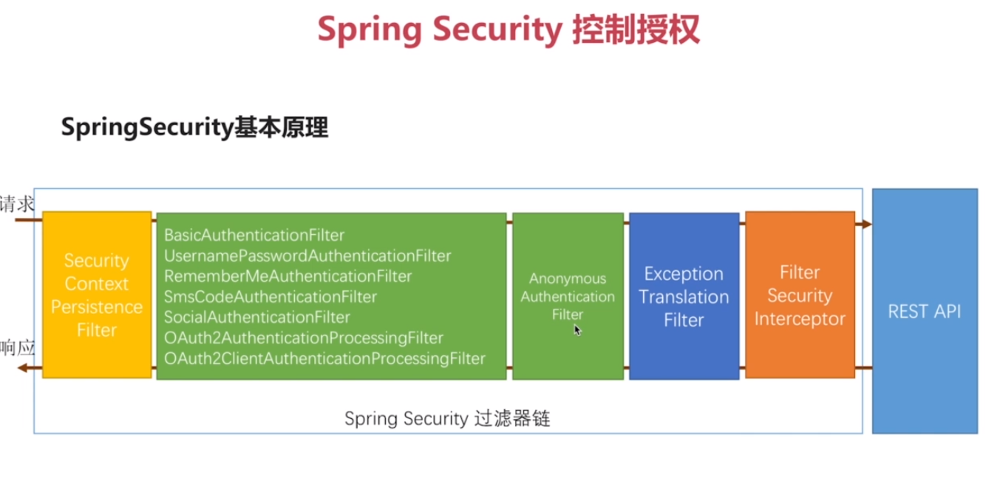

#### Spring Security 动态权限设计
实现了动态权限系统.

* CustomInvocationSecurityMetadataSourceService
>
    从数据库中加载所有需要被权限校验的uri.并生成uri对应的路由匹配器.
    每当有请求到来,判断该请求uri是否被包含在我们要校验的uri中.
    如果匹配到,将该uri需要的权限返回.
>

* CustomAccessDecisionManager
>
    CustomInvocationSecurityMetadataSourceService
    确认该请求uri需要校验后,通过该类匹配当前登录用户是否拥有该uri所需的权限.
    如果没有,抛出异常.
>

* CustomInvocationSecurityMetadataSourceService
>
    将其配置到security的过滤链中,拦截所有请求,
    然后对每个请求调用上面的两个类验证
>

* CustomUserService
>
    登录时查询要登陆的用户的信息.包括其拥有的权限.
>

* 以上实现的是权限的完全动态的配置,包括运行时修改权限管理url对应的权限都可以.
* 如果可以将所有权限url和对应权限写死.只需要可以动态配置角色,可以使用如下的逻辑.

#### Spring Security源码分析

* SecurityContextPersistenceFilter 总的负责拦截所有相关的过滤器
* 绿色的.负责某一种身份验证方式的过滤器
* AnonymousAuthenticationFilter 匿名身份过滤器:
>
    在所有身份验证方式的过滤器的末尾
    
    判断当前的securityContext中是否有Authentication.
    也就是是否有成功登录的用户信息.
    如果没有,它就会创建一个匿名的Authentication放入.
    设为默认的匿名用户和匿名权限
>
* FilterSecurityInterceptor 过滤器安全拦截器:
>
    所有处理过程的最末端,用于判断当前登录用户是否拥有对应请求uri的权限
>

* 授权相关类的调用关系,从FilterSecurityInterceptor拦截器开始:
该拦截器将所有request等对象都封装到了一个Object o中.

* 其权限会从SecurityMetadataSource该类中加载.
* 如果在该处理过程中抛出异常,会进入ExceptionTranslationFilter
* 访问AccessDecisionManger接口.该接口实现类中维护了一组
    AccessDecisionVoter,每个Voter都有自己的逻辑去校验该请求是否通过.
    最终又Manager判断是否允许其通过.
    * 其三个子实现类的逻辑分别为
        * AffirmativeBased:一个Voter允许就通过,默认用它
        * ConsensusBased:比较票数
        * UnanimousBased:一个Voter拒绝就不通过
* WebExpressionVoter:web表达式投票人.security3之后,web环境中,所有
投票工作由该类完成.

* security支持的权限表达式,这些表达式都跟在.antMatchers(urls...)后

* 可以这样连接多个表达式.

* 如果需要自定义扩展需要验证的uri,不希望直接写死在config类中.
可让每个模块实现自定义的AuthorizeConfigProvider接口.  
然后AuthorizeConfigManager类负责将所有模块自行实现的Provider接口
中的权限配置汇总.  
具体实现逻辑如下
>
    自定义AuthorizeConfigProvider接口.和security的配置类一样.
    可以将http.authorizeRequests()方法返回的值作为参数,
    自定义一个 void config(xxx)方法,
    其他人就可以在自己的项目中实现自己要处理的权限逻辑.并将其实现类注入spring
    
    然后再定义一个AuthorizeConfigManager.就直接将所有的AuthorizeConfigProvider
    接口实现类自动注入一个集合,循环该集合,进行配置即可.
>

* 可如下配置,使用表达式进行权限验证.其意思是
    调用spring bean name为 rbacService的bena的hasPermission方法,传入对应参数.
    然后我们可以自定义该bean和方法,返回boolean.

