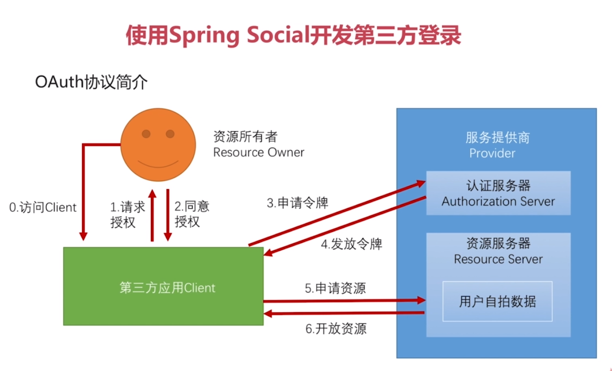
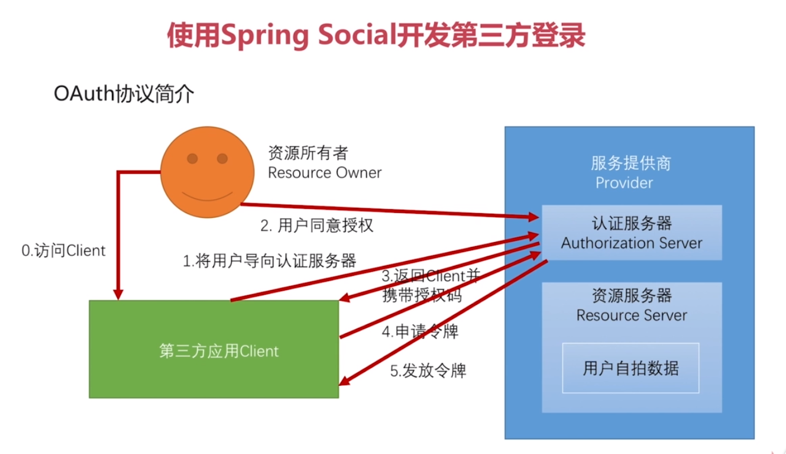
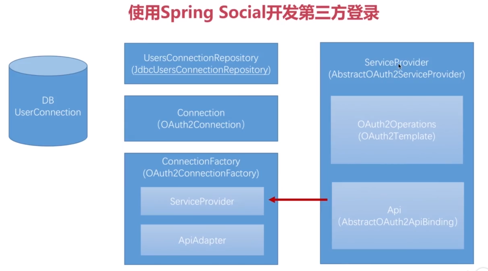

#### OAuth2协议
* 角色
    * client: 第三方服务
    * Resource Owner: 资源所有者,也就是用户
    * Provider: 服务提供商-例如QQ这样我们需要他的用户信息的提供商
        * Authorization: 认证服务器,用来获取token
        * Resource Server: 资源服务器,用token来获取client授权了的资源
* 普通流程

* OAuth协议中的授权模式
    * 授权码模式
    * 密码模式
    * 客户端模式
    * 简化模式
    
* 授权码模式

与其他模式的区别在于,  
其他模式同意授权的动作是在第三方应用上完成的,该模式在认证服务器上完成;    
用户同意授权后,该模式中认证服务器返回第三方的是一个授权码,而不是直接返回令牌.

#### Spring Social

* 其基本原理就是在最后一步,用户通过token获取到用户信息后,  
    在SpringSecurity中,将用户信息构建成Authentication,并放入Security,也就相当于登录成功了.  

* Social框架将这么一个流程封装到了一个SocialAuthenticationFilter过滤器中,  
    然后将该过滤器加到了SpringSecurity的过滤器链中.

* ServiceProvider(AbstractOAuth2ServiceProvider):服务提供商的抽象,
针对不同的服务提供商,例如QQ/微信,需要继承并实现不同的类

* OAuth2Operations(OAuth2Template):操作接口,封装了OAuth2协议,从用户授权到获取令牌的所有流程

* Api(AbstractOAuth2ApiBinding):自行实现的接口,根据服务提供商提供获取用户信息这也样一个行为

* Connection(OAuth2Connection):封装获取到的用户信息

* ConnectionFactory(OAuth2ConnectionFactory):创建Connection实例,也就是在这个工厂中,为了创建  
    Connection,包含了ServiceProvider,包括上面这些步骤,都是通过该类调用,知道最后一步获取到用户信息,  
    然后该类创建Connection.
* ApiAdapter:在Api和Connection之间做一个适配,将每个服务提供商提供的不同的用户信息适配

* DBUserConnection:Social提供的一张数据库表,存储了自己系统里的普通用户和服务提供商获取的用户的一个  
    对应关系.由此,可以在第三方登录的时候,知道是哪个本地用户登录了

* UserConnectionRepository(JdbcUsersConnectionRepository):用来操作DBUserConnection表,
    将第三方登陆用户和自己的业务用户联系起来

#### 再次整理下上面的逻辑
* 我们需要的是Connection(OAuth2Connection),也就是用户信息.
* 获取用户信息,需要ConnectionFactory(OAuth2ConnectionFactory).该工厂封装了所有步骤.
* 构建这个工厂,需要ServiceProvider(AbstractOAuth2ServiceProvider)服务提供商
和ApiAdapter适配器,适配获取用户信息的Api(AbstractOAuth2ApiBinding)接口和Connection用户信息
* 而为了构建ServiceProvider服务提供商,就需要OAuth2Operations(OAuth2Template):操作接口(从用户授权到获取令牌的所有流程)
和Api(AbstractOAuth2ApiBinding)根据服务提供商提供获取用户信息这也样一个行为的接口
* 所以,最根本的实现是从底层的API接口开始,一步一步往上走

#### 开始开发第三方登录 :zx-security-core
* Api(AbstractOAuth2ApiBinding):QQ接口:QQImpl实现类:获取用户信息.
>
    定义QQ接口,定义获取用户信息方法.
    定义QQImpl类,实现QQ接口,并继承AbstractOAuth2ApiBinding类.
    
    AbstractOAuth2ApiBinding类中.
    有accessToken(令牌)属性,用来向服务提供商换取用户信息(授权码模式第6步).
    因为该属性,每个用户都是不同的,所以QQImpl不是单例对象,每次进行第三方登录时,都会创建一个QQImpl;
    还有一个RestTemplate类.用来发送http请求.获取用户信息.
    
    在qq的文档中.获取用户信息,需要三个参数.其中的令牌就是accessToken.
    所以只需要再在QQImpl中添加上剩余的两个参数appId和openId即可.
    
    此外还有两个路径.
    一个就是根据这三个参数获取用户信息的路径.
    还一个是用accessToken获取用户openId的路径.
    
    然后具体逻辑见该类注释
>

* OAuth2Operations(OAuth2Template):操作接口,封装了OAuth2协议,从用户授权到获取令牌的所有流程;  
该类暂时使用spring social 的默认实现.(补充,目前自定义了.修改了用授权码换取到token并返回解析的一些方法)

* ServiceProvider(AbstractOAuth2ServiceProvider):服务提供商的抽象.
>
    定义QQServiceProvider,实现AbstractOAuth2ServiceProvider接口.
    实现了其创建QQImpl的抽象方法和 注入 OAuth2Operations(OAuth2Template)的构造方法.
    
    具体见该类注释
>

* ApiAdapter:在每个服务提供商的用户信息和spring social的标准信息之间做一个适配,将每个服务提供商提供的不同的用户信息适配
>
    定义QQAdapter类,实现ApiAdpater<QQ>接口.
    完成从每个运营商的不同的用户信息中,获取出用户id/昵称/头像/主页信息的适配方法
    等其他方法.
>

* ConnectionFactory(OAuth2ConnectionFactory):Connection实例工厂
>
    需要有ApiAdapter 和 ServiceProvider.
    实现其构造函数即可
>

* UserConnectionRepository(JdbcUsersConnectionRepository):用来操作DBUserConnection表,将第三方登陆用户和自己的业务用户联系起来
>
    定义了social的配置类,并继承了SocialConfigurerAdapter类,实现getUsersConnectionRepository方法即可
    此时还需要创建对应的表,对应的sql在JdbcUsersConnectionRepository类的同级目录下(JdbcUsersConnectionRepository.sql)
    需要手动创建.如果需要给表名加前缀.可以在创建JdbcUsersConnectionRepository该类后,setTablePrefix.
    
    该表的一些字段
    用户id(自己业务系统中)/服务提供商的id/服务提供商的用户id  这个字段存储了业务系统中的用户和第三方登录用户的对应关系
    还有ApiAdapter适配器中设置的值.包括用户名/用户主页.用户头像等
>

* SocialUserDetailsService:根据用户id(自己业务系统的)加载对应的用户信息返回
>
    直接让之前的CustomUserDetailsService类,再实现SocialUserDetailsService接口即可.
    再将该类从browser模块移动到demo模块.因为该类需要根据业务表自行实现.
>

* 添加qq登录所需的配置属性
>
    定义QQProperties extends SocialProperties(该类就需要appId和appSecert).
    然后只需再增加一个providerId(服务提供商唯一标识即可)
    然后在定义一个SocialProperties,将QQProperties作为属性.
    再将SocialProperties作为属性放入SecurityProperties作为属性.
        
    再实现qq配置自动注入类.
    @Configuration
    @ConditionalOnProperty(prefix = "zx.security.social.qq",name = "appId")
    public class QQAutoConfig extends SocialAutoConfigurerAdapter{
        @Autowired
        private SecurityProperties securityProperties;
    
        @Override
        protected ConnectionFactory<?> createConnectionFactory() {
            QQProperties qq = securityProperties.getSocial().getQq();
            return new QQConnectionFactory(qq.getProviderId(),qq.getAppId(),qq.getAppSecret());
        }
        
    }    
    
    再在SocialConfig中配置
    /**
         * 将SpringSocial配置类加入spring Bean,以用来注入SpringSecurity配置类
         * 之所以直接返回,只因为该类中已经有了默认的一些配置,
         * 例如将SocialAuthenticationFilter过滤器加入过滤器链等
         */
        @Bean
        public SpringSocialConfigurer zxSocialSecurityConfig() {
            return new SpringSocialConfigurer();
        }
     然后将其加入security的配置链中,就会在security当然过滤器链中加入social的过滤器
     http.apply(zxSocialSecurityConfig).and()
 
>

* 然后在页面上配置
>
    <h1>社交登录</h1>
    <a href="/auth/qq">QQ登录</a>
    
    注意,所有/auth请求.都会被SocialAuthenticationFilter拦截
    然后第二段/qq就是providerId.也就是每个服务提供商的唯一标识
    这样.点击这个链接.就会进入qq登录
>

* 用户自行登录成功后,spring social默认的回调地址还是/quth/qq  
如果需要修改回调地址.可以选择
>
    以下是为了适配课程中的 /qqLogin/callback.do 这么一个回调地址
    
    自定义了一个CustomSpringSocialConfigurer类,继承了SpringSocialConfigurer,
    重写了获取过滤器的方法,在该方法中,照样调用父类的实现,然后在返回结果,也就是该过滤器后,
    修改了它要处理的url值.
    然后在上面返回SpringSocialConfigurer Bean的时候,返回自己定义的这个类,
    并且需要在构造参数中注入自定义的url.
    
    然后上面引导用户跳转到qq登录的url地址,也需要改成我们自己自定义的url
    然后还要修改url的后缀,也就是/callback.do这段.只需要把providerId改成对应的值即可.
>

* 此处.因为课程中的qq帐号的完整回调地址是http://www.pinzhi365.com/qqLogin/callback.do  
为了,测试,还需要在hosts中将该主机名指向127.0.0.1,然后访问的时候.  
也需要用www.pinzhi365.com替代127.0.0.1  
这样子是为了.让spring social传递给qq的回调地址的主机名,也变成www.pinzhi365.com
 
* 然后,登录完成后.qq回调回来.可以在之前的过滤器中看到日志,跳转到了默认的登录页..
> 引发跳转的请求是:http://www.pinzhi365.com/signin

* 整个social大致的处理流程如下

>
    一个过滤器(SocialAuthenticationFilter),拦截未做身份验证的请求.
    SocialAuthenticationService负责根据请求中携带的providerId,找到对应的ConnectionFactory,也就是qq的连接工厂,
    该工厂创建出对应的Authentication(SocialAuthenticationToken).然后传给AuthenticationManager.
    该类根据其类型不同,挑选出对应的服务提供商(AuthenticationProvider)进行登录.
    然后还会根据该第三方用户的id去关联表中查询其在业务系统中的用户id,然后查询出对应的用户,然后封装为SocialUserDetail.
    再将这个userDetail注入到之前的Authentication中.
    
    需要注意.这整个流程,同时需要处理用户qq登录前和qq登录回调两个需求.
    登陆前,引导用户到qq登录,回调时,根据返回的授权码,再去获取到token.再用token获取到用户信息.然后注入到对像中,
    
    可查看OAuth2AuthenticationService类的getAuthToken方法.
    根据用户是否有code(授权码)判断用户是哪一步骤.如果没有.抛出了一个重定向异常,让用户重定向到qq的登录url去.
    
    此时.该qq登录还有bug,就是跳转回来后.进入了signin页面,然后404,跳转到了自定义的错误页面.
    其原因就是在拿到授权码,换取token时,返回的是text/html格式的数据(其实就是一个用&join了若干属性的字符串),而social需要的是json格式的数据.
    然后导致结果为空,抛出异常后,在它自己的异常处理器中跳转到了/signin路径.
    
    目前他(OAuth2Template(用来发送换取令牌Http请求的类))能处理的格式就是HttpEntity(form)格式的和json格式的响应.
    QQOAuth2Template该类.是自定义用来是适配qq的授权码换取令牌的请求和标准OAuth2协议不同的地方的类.
    
    
    
>

* 处理完这个后,已经获取到了Connection(第三方用户信息).但仍然跳转到了  
> 引发跳转的请求是:http://www.pinzhi365.com/signup    

其原因是该第三方用户是第一次登录,在其自带的关联表中找不到对应的关联记录.  
所以需要跳转到在注册页面(signupUrl).注册出一个业务系统的用户帐号  
>
    配置上自定义的signupUrl属性.并在注入socialConfiguration类的时候修改默认的该属性.
    然后在demo增加注册(或绑定已有帐号)页面,并跳转到注册方法.
    这样就可以在第一次qq登录跳转到自定义的注册页面.
    
    如下.需要这么一个工具类
     /**
      * 这个服务提供者 注册 工具类 的作用就是
      * 在注册中如何获取到已经通过验证的第三方用户信息,
      * 以及登录成功后.如何将注册好的业务系统用户信息传回给social.
      */
     @Bean
     public ProviderSignInUtils providerSignInUtils(ConnectionFactoryLocator connectionFactoryLocator) {
         return new ProviderSignInUtils(connectionFactoryLocator,
                 getUsersConnectionRepository(connectionFactoryLocator));
     }
    然后定义了这么一个方法,获取当前已经登录的第三方用户信息
    //用来获取第三方用户信息的工具类
    @Autowired
    private ProviderSignInUtils providerSignInUtils;
    /**
     * 获取到当前已经登录的第三方用户信息
     */
    @GetMapping("/social/user")
    public SocialUserInfo getSocialUserInfo(HttpServletRequest request) {
        SocialUserInfo userInfo = new SocialUserInfo();
        //从session中获取第三方用户信息
       Connection<?> connection = providerSignInUtils.getConnectionFromSession(new ServletWebRequest(request));

        return userInfo.setProviderId(connection.getKey().getProviderId())
                .setProviderUserId(connection.getKey().getProviderUserId())
                .setNickname(connection.getDisplayName())
                .setHeadimg(connection.getImageUrl());
    }
      
    下面是注册或绑定方法
    /**
     * 注册
     */
    @PostMapping("/register")
    public void register(User user, HttpServletRequest request) {
        //注册或是绑定用户逻辑
        //成功后都会拿到用户唯一标识
        //此处暂时用 用户名作为唯一标识
        String userId = user.getUsername();
        //将用户唯一标识 传递给 social, social通过request从session中取出第三方用户信息
        //和该唯一标识一起插入到  它自带的 关联表中.
        providerSignInUtils.doPostSignUp(userId,new ServletWebRequest(request));
    }  
    
    
    如果需要让第一次登录的第三方用户免去注册或绑定流程, 可以实现如下接口
    /**
     * author:ZhengXing
     * datetime:2018-01-06 13:02
     * 实现该接口,可以让social自动调用该方法,
     * 将第一次第三方登录直接注册到业务系统中,不再跳转到绑定或注册页面
     */
    public class CustomConnectionSignUp implements ConnectionSignUp{
        /**
         * 根据第三方用户信息. 在业务系统用户表中创建用户,并返回 用户唯一标识,以绑定到social的关联表中
         */
        @Override
        public String execute(Connection<?> connection) {
            //此处暂时用 昵称表示用户唯一标识
            return connection.getDisplayName();
        }
    }
    
    然后如下,注入
     @Autowired(required = false)
     private ConnectionSignUp connectionSignUp;
 
     /**
      * 实现获取UsersConnectionRepository的方法
      *
      * ConnectionFactoryLocator用来获取连接工厂(可能有多个.所以要查找)
      */
     @Override
     public UsersConnectionRepository getUsersConnectionRepository(ConnectionFactoryLocator connectionFactoryLocator) {
         //第三个参数是对存入的数据加密,此处不做任何加密
         JdbcUsersConnectionRepository jdbcUsersConnectionRepository = new JdbcUsersConnectionRepository(
                 dataSource, connectionFactoryLocator, Encryptors.noOpText());
         //直接将 用来实现第一次第三方登录的用户直接在 业务系统中创建对应用户的 逻辑的接口注入.他可能为空.
         jdbcUsersConnectionRepository.setConnectionSignUp(connectionSignUp);
         return jdbcUsersConnectionRepository;
     }
>

* 遇到一个问题:第二次第三方登录,关联表中有了记录,还是跳转到注册页面.  
不断的打断点.最后定位到了加载UsersConnectionRepository的一个地方.  
它遍历若干social的config类,循环调用获取这个repository类的方法,如果
获取到了,直接break;  
而我们自定义的socialConfig类并不是首位,所以,在自定义的配置类上加@Order(1),
让其变为首位,即可加载出自己的repository类.

而之所以不是首位的根本原因,是除了自定的通用的socialConfig外,还实现了一个QQAutoConfig,
是为了将qq的appId等信息注入到ConnectionFactory中.

#### 微信登录 大致相同.

#### QQ登录 绑定帐号流程
* 如上的登录,都是用户直接使用社交帐号登录.登陆前系统不知道它是业务系统中的哪个用户.  
还有一种情况是.业务系统中的用户登录后,选择绑定社交帐号,如此,跳转到第三方登录页面.

* 首先需要查询出当前登录用户,各个社交帐号的绑定情况(绑定了哪些,没绑定哪些)
>
    Spring Social提供了相应接口查询.
    在ConnectController的 connectionStatus方法.路径为 GET /connect
    该方法在查询出其绑定状态后,会查找一个默认的视图(/connect/status)返回.
    
    
    如下类,可以作为一个抽象视图,获取到coneectionStatus方法返回的视图.
    注意,@Component("connect/status"),名字需要和它返回的视图路径名相同
    /**
     * 自定义 用户社交帐号绑定状态 视图
     * spring social提供了查询业务帐号 其 绑定社交帐号 状态的一个接口,
     * 默认返回到这么一个视图
     */
    @Component("connect/status")
    public class CustomConnectionStatusView extends AbstractView{
    
        @Autowired
        private ObjectMapper objectMapper;
    
        /**
         * 可以通过该方法将视图呈现在jsp上等.
         * 此处将其转换为json返回.
         * @param map 也就是model数据
         * @param httpServletRequest
         * @param httpServletResponse
         * @throws Exception
         */
        @Override
        protected void renderMergedOutputModel(Map<String, Object> map, HttpServletRequest httpServletRequest, HttpServletResponse httpServletResponse) throws Exception {
            //取出connectionStatus方法放入model的.该业务用户的社交帐号绑定状态集合
            Map<String, List<Connection<?>>> connections = (Map<String, List<Connection<?>>>) map.get("connectionMap");
    
            //我们只需要每个社交帐号是否绑定的信息即可.
            Map<String, Boolean> result = new HashMap<>();
            for (Map.Entry<String, List<Connection<?>>> item : connections.entrySet()) {
                //该map的key是 服务提供商id,例如 qq, weixin
                //值是social帐号关联表中,该业务用户绑定的所有该服务提供商的帐号(一般就一个).
                //所以此处判断其list是否为空,即可知道是否绑定过
                result.put(item.getKey(), !CollectionUtils.isEmpty(item.getValue()));
            }
    
            //转为json输出
            httpServletResponse.setContentType(MediaType.APPLICATION_JSON_UTF8_VALUE);
            httpServletResponse.getWriter().write(objectMapper.writeValueAsString(result));
    
        }
    }
>

* 然后是,可以选择没绑定的社交帐号,绑定
>
    新建一个绑定页面,post请求 /connect/{providerId} 路径即可.
    绑定成功后,social会默认回调到/connect/{providerId}Connected 路径.
    
    定义如下抽象视图
    /**
     * author:ZhengXing
     * datetime:2018-01-07 12:36
     * 自定义 用户社交帐号绑定成功回调 视图
     * spring social提供了 用户登录后绑定某个社交帐号的url(/connect/{providerId})
     * 成功后,默认返回到/connect/{providerId}Connected
     */
    public class CustomConnectedView extends AbstractView{
    
        /**
         * 此处将返回 社交帐号成功绑定的 页面
         * @param map 也就是model数据
         * @throws Exception
         */
        @Override
        protected void renderMergedOutputModel(Map<String, Object> map, HttpServletRequest httpServletRequest, HttpServletResponse response) throws Exception {
            response.setContentType(MediaType.TEXT_HTML_VALUE + ";charset=UTF-8");
            response.getWriter().write("<h3>绑定成功</h3>");
        }
    }
    
    然后配置到微信,因为每个社交帐号成功绑定的视图页面应该都是差不多的.,而且需要用户可以自定义该视图bean
    /**
     * 业务用户登陆后, 绑定社交帐号 成功后的回调视图
     * 此处可以用户自定义,当没有(name = "weixinConnectedView")bean时,才使用该bean
     */
    @Bean("connect/weixinConnected")
    @ConditionalOnMissingBean(name = "weixinConnectedView")
    public View weixinConnectedView() {
        return new CustomConnectedView();
    }
>

* 最后是解绑.
>
    和绑定的路径是相同的,都是/connect/{providerId}
    区别在于绑定是POST,解绑是DELETE.
    
    解绑成功后的回调视图和绑定成后的视图路径也大致相同.
    是/connect/{providerId}Connect,少了"ed".
    
    可以和绑定成功用同一视图
    /**
     * author:ZhengXing
     * datetime:2018-01-07 12:36
     * 自定义 用户社交帐号绑定成功  或解绑成功 回调视图
     * spring social提供了 用户登录后绑定某个社交帐号的url(/connect/{providerId})
     * 成功后,默认返回到/connect/{providerId}Connected  和/connect/{providerId}Connect
     */
    public class CustomConnectedView extends AbstractView{
    
        /**
         * 此处将返回 社交帐号成功绑定的 页面
         * @param map 也就是model数据
         * @throws Exception
         */
        @Override
        protected void renderMergedOutputModel(Map<String, Object> map, HttpServletRequest httpServletRequest, HttpServletResponse response) throws Exception {
            response.setContentType(MediaType.TEXT_HTML_VALUE + ";charset=UTF-8");
    
            //绑定成功后,有connection对象,解绑成功时没有
            if (map.get("connection") == null) {
                response.getWriter().write("<h3>解绑成功</h3>");
            }else{
                response.getWriter().write("<h3>绑定成功</h3>");
                
            }
        }
    }
    然后配置类这么写,多加一个beanName
    /**
     * 业务用户登陆后, 绑定社交帐号 成功后的回调视图
     * 此处可以用户自定义,当没有(name = "weixinConnectedView")bean时,才使用该bean
     */
    @Bean({"connect/weixinConnected","connect/weixinConnect"})
    @ConditionalOnMissingBean(name = "weixinConnectedView")
    public View weixinConnectedView() {
        return new CustomConnectedView();
    }
>