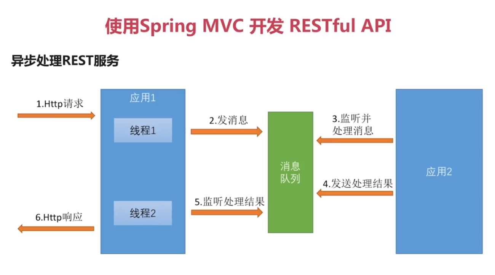

#### Spring Security 

#### bug记录
* 如果出现idea父模块无法导入子模块，可以在设置里面搜索maven，找到忽略的文件，去掉该子模块的勾选即可。
* 如果导入后，发现还是未解决问题，可以打开idea的maven project，选中该项目，刷新即可
* SpringMVC中RequestMapping("/")这个/不能乱加,如果controller类已经有/user这样一个前缀,  
那么如果在方法上在注解上"/",访问的路径就会为/user/,使用/user将无法访问
* !!!之前遇到HttpClient发送json串请求controller方法,参数一直为null.是因为没有加@RequestBody.

#### 奇淫巧技
* !!!666 使用TimeUnit.SECONDS.sleep(x);可以使用秒..暂停线程.

* 在idea的MavenProject窗口选择module，右击选择show dependencies,可以很清楚地查看依赖关系图

* 如下,可以获取classpath目录的路径(该路径为classes下的resources路径):  
ClassPathResource resource = new ClassPathResource("mock/response/01.json");
resource.getFile();

* Commons-lang包中有RandomStringUtils可以生成随机数

* 在@ControllerAdvice注解的类中的@ExceptionHandle注解的方法上,可以使用如下注解返回指定状态码:  
@ResponseStatus(HttpStatus.INTERNAL_SERVER_ERROR)

* JsonPath:在github中的一个项目，可以用类似jquery选择器那样的语法，取出一个json中任意的信息。

* 在spring mvc中使用url传参时,可以指定参数的正则表达式(如下就是指定id必须为数字):    
@GetMapping("/user/{id:\\d+}")  
注意,如果传参不符合该正则,返回的状态码将是404

* 使用如下代码，可以在不动实体类的情况下，发射实体类的toString方法：  
ReflectionToStringBuilder.toString(userQueryCondition, ToStringStyle.MULTI_LINE_STYLE);  
直接sout上面的表达式即可输出；  

* 如果在controller中使用springDataJpa的pageable对象接收分页参数，可以用如下注解，来指定其默认值：  
@PageableDefault(size = 10,page = 0,sort = "username,asc") Pageable pageable

#### 搭建环境
1. 新建项目zx-security
2. 在该项目下，建立四个子模块  
    * app
    * browser
    * core
    * demo
3. 在zx-security该父模块下添加依赖:  
>
    <dependencyManagement>
        <dependencies>
            <!--管理spring的版本-->
            <dependency>
                <groupId>io.spring.platform</groupId>
                <artifactId>platform-bom</artifactId>
                <version>Brussels-SR4</version>
                <type>pom</type>
                <scope>import</scope>
            </dependency>
            <dependency>
                <groupId>org.springframework.cloud</groupId>
                <artifactId>spring-cloud-dependencies</artifactId>
                <version>Dalston.SR2</version>
                <type>pom</type>
                <scope>import</scope>
            </dependency>
        </dependencies>
    </dependencyManagement>
>
和编译插件：
>
    <build>
        <plugins>
            <plugin>
                <groupId>org.apache.maven.plugins</groupId>
                <artifactId>maven-compiler-plugin</artifactId>
                <version>2.3.2</version>
                <configuration>
                    <source>1.8</source>
                    <target>1.8</target>
                    <encoding>UTF-8</encoding>
                </configuration>
            </plugin>
        </plugins>
    </build>    
>
4. 在zx-security-core子模块中增加依赖(自行查看)
5. 然后在app模块中加入core模块的依赖:
>
        <dependency>
            <groupId>com.zx.security</groupId>
            <artifactId>zx-security-core</artifactId>
            <version>${zx.security.version}</version>
        </dependency>
>
注意，该version是写在父模块中的，可直接引用
6. 在browser中加入依赖：
>
        <dependency>
            <groupId>com.zx.security</groupId>
            <artifactId>zx-security-core</artifactId>
            <version>${zx.security.version}</version>
        </dependency>
        <dependency>
            <groupId>org.springframework.session</groupId>
            <artifactId>spring-session</artifactId>
        </dependency>
>
7. 在demo中依赖：
>
        <dependency>
            <groupId>com.zx.security</groupId>
            <artifactId>zx-security-browser</artifactId>
            <version>${zx.security.version}</version>
        </dependency>
>

#### Hello World
1. 在demo中新建com.zx包，然后新建DemoApplication类，并加入@SpringBootApplication注解等。  
写到这的时候，我才意识到，这就是springBoot项目不依赖spring为父模块，而是依赖自定义的父模块的写法。
2. 直接在该Application类上写@RestController，然后写个/test
3. 新建application.yml,配置如下(如果不关闭security,默认用户名为user,密码为启动时输出的一串默认密码):
>
spring:
  datasource:
    driver-class-name: com.mysql.jdbc.Driver
    url: jdbc:mysql://127.0.0.1:3306/zx-security?useUnicode=yes&characterEncode=UTF-8
    username: root
    password: 123456
  session:
    store-type: none  #暂时关闭spring-session的配置，不然会报错
  security:
    basic:
      enabled: false #暂时关闭spring-security的配置，不然会报错
  
>
4. 注意，此时如果将demo项目打包，只会是一个普通的jar，无法直接运行启动spring boot，  
还需要在pom.xml中加入，才可以将它包含的依赖一起打包，以便直接用jar运行spring boot,  
包名就是finalName:
>
    <build>
        <plugins>
            <plugin>
                <groupId>org.springframework.boot</groupId>
                <artifactId>spring-boot-maven-plugin</artifactId>
                <executions>
                    <execution>
                        <goals>
                            <goal>repackage</goal>
                        </goals>
                    </execution>
                </executions>
            </plugin>
        </plugins>
        <finalName>Demo</finalName>
    </build>
>

#### Restful
* 用URL描述资源
* 用HTTP方法描述行为
* 用HTTP状态码表示不同的结果
* 用json交互数据
* 资源表达中包含了链接信息，也就是返回的json中包含其他的api url（一般达不到该要求）
例如：
>
/user?name=zx   GET     查名字
/user/1         GET     查id
/user           POST    增
/user/1         DELETE  删
/user/1         PUT     改
>

#### Web层测试用例编写
1. 在demo项目引入依赖:
>
        <dependency>
            <groupId>org.springframework.boot</groupId>
            <artifactId>spring-boot-starter-test</artifactId>
        </dependency>

>

2. 编写如下测试类即可测试controller的代码:
>
    @SpringBootTest
    @RunWith(SpringRunner.class)
    public class UserControllerTest {
        //spring的web容器
        @Autowired
        private WebApplicationContext wac;
    
        //mvc模拟类
        private MockMvc mockMvc;
    
        //使用容器构建mvc模拟类
        @Before
        public void setup() {
            mockMvc = MockMvcBuilders.webAppContextSetup(wac).build();
        }
    
        @Test
        public void whenQuerySuccess() throws Exception {
            /**
             * 向/user发起get请求，其中header的contentType为json，参数自定义
             * 并且期望，返回的http状态码为200，
             * 并且期望，将返回的json解析后，数组长度为3
             */
            mockMvc.perform(MockMvcRequestBuilders.get("/user")
                    .contentType(MediaType.APPLICATION_JSON_UTF8)
                    .param("username", "zx"))
                    .andExpect(MockMvcResultMatchers.status().isOk())
                    .andExpect(MockMvcResultMatchers.jsonPath("$.length()").value(3));
        }
    }
>

#### @JsonView使用-注意,指定视图后,对象所有属性都需指定视图,否则将不会返回
1. 将要返回成json串的实体类,进行改造:  
创建不同的视图,每个视图代表一个controller的方法,区分每个方法返回时,该对象该返回的属性和不返回的属性.  
以往我的写法都是创建多个返回的dto对象,显得很_麻瓜
>
    @Data
    @AllArgsConstructor
    @NoArgsConstructor
    public class User {
    
        //用户简单视图
        public interface UserSimpleView {};
    
        //用户详情视图
        public interface  UserDetailView extends UserSimpleView {};
    
        //将该属性在简单视图展示
        @JsonView(UserSimpleView.class)
        private String username;
    
        //将密码属性在详情视图才展示,
        // 但是详情视图仍然会显示简单视图的属性,因为有一个继承关系
        @JsonView(UserDetailView.class)
        private String password;
    }
>

2. 在controller层的方法上增加如下注解,即可返回指定视图:  
@JsonView(User.UserSimpleView.class)

#### hibernate Validation 自定义校验注解
1. 自定义注解:
>
    /**
     * author:ZhengXing
     * datetime:2017-11-19 13:51
     * 

     * 自定义校验注解
     * 

     * 如下指定了该校验注解类的校验器
     * @Constraint(validatedBy = CustomValidator.class)
     *
     * 该注解的三个属性是从@NotBlank拷贝过来的
     */
    @Target(ElementType.FIELD)
    @Retention(RetentionPolicy.RUNTIME)
    @Constraint(validatedBy = CustomValidator.class)
    public @interface CustomValidAnnotation {
        String message();
    
        Class<?>[] groups() default {};
    
        Class<? extends Payload>[] payload() default {};
    }
>

2. 自定义校验器
>
    /**
     * author:ZhengXing
     * datetime:2017-11-19 13:54
     * 自定义校验处理类
     * 第一个泛型是 自定义的验证注解类
     * 第二个泛型是 要验证的那个字段的字段类型
     *
     * 注意:该类无需@Compoent等注解,在其实现该接口的时候,已经加入bean
     * 可以注入一些service,进行一些注入某个id是否在数据库中存在的校验
     */
    public class CustomValidator implements ConstraintValidator<CustomValidAnnotation,Object> {
        //校验器初始化
        @Override
        public void initialize(CustomValidAnnotation constraintAnnotation) {
            System.out.println("校验器初始化");
        }
    
        //校验
        @Override
        public boolean isValid(Object value, ConstraintValidatorContext context) {
            System.out.println(value);
            return true;
        }
    }
>

#### 异常处理
* SpringBoot的BasicErrorController类,是其对异常的原始处理,将请求分为text/html和非它两种,分贝返回页面  
和json;它的做法也就是在返回页面的方法上添加如下注解:  
@RequestMapping(produces = {"text/html"})

* 在src/resources目录下新建resources/error/404.html,注意,此时目录为resources/resources/error.  
springboot的404错误将会被转发到该页面

#### 拦截方式
* 顺序: Filter -> Interceptor -> ControllerAdvice -> Aspect -> Controller
* 过滤器
    * 定义过滤器并添加@Compoent注解,但这样无法设置要过滤的路径
    * 定义过滤器,并添加@WebFilter注解,可以设置过滤路径,如下:
        >
            @WebFilter(filterName="druidWebStatFilter",urlPatterns="/*",
                    initParams={
                            @WebInitParam(name="exclusions",value="*.js,*.gif,*.jpg,*.bmp,*.png,*.css,*.ico,/druid/*")// 忽略资源
                    })
        >
    * 定义过滤器,不添加注解,使用如下代码:
        >
                @Configuration
                public class WebConfig{
                    @Bean
                    public FilterRegistrationBean timeFilter() {
                        //创建过滤器注册器
                        FilterRegistrationBean filterRegistrationBean = new FilterRegistrationBean();
                        //创建过滤器实例
                        TimeFilter timeFilter = new TimeFilter();
                        //注册
                        filterRegistrationBean.setFilter(timeFilter);
                        //声明过滤器要过滤的url
                        List<String> urlList = new ArrayList<>();
                        urlList.add("/*");
                        filterRegistrationBean.setUrlPatterns(urlList);
                
                        return filterRegistrationBean;
                    }
                }
        >

* 拦截器
    * 配置并注册拦截器:
        >
            @Configuration
            public class WebConfig extends WebMvcConfigurerAdapter{
            
                @Autowired
                private TimeInterceptor timeInterceptor;
            
                //配置拦截器
                @Override
                public void addInterceptors(InterceptorRegistry registry) {
                    registry.addInterceptor(timeInterceptor);
                }
        >
    * 注意,拦截器的afterCompletion()方法的第三个参数可以接收到controller层的异常,但如果自定义了异常处理器,  
    也就是@ExceptionHandler,该方法的该参数将无法捕获到异常,将为null

* 切片(Aspect)
    * 导入依赖:
        >
                <dependency>
                    <groupId>org.springframework.boot</groupId>
                    <artifactId>spring-boot-starter-aop</artifactId>
                </dependency>    
        >
    * 如下配置:
        >
            /**
             * author:ZhengXing
             * datetime:2017-11-19 15:33
             * 自定义切片AOP
             *
             * aop时间:
             * @After 之后
             * @Before 之前
             * @AfterThrowing 抛出异常后
             * @Around 包含上面三个注解
             */
            @Aspect
            @Component
            public class TimeAspect {
                //拦截任何返回值的userController中任何方法任何参数
                @Around("execution(* com.zx.web.controller.UserController.*(..))")
                public Object handleControllerMethod(ProceedingJoinPoint proceedingJoinPoint) throws Throwable {
            
                    System.out.println("time aspect start");
                    
                    //获取方法所有参数
                    Object[] params = proceedingJoinPoint.getArgs();
                    for (Object param : params) {
                        System.out.println("param is " + param );
                    }
            
                    long startTime = new Date().getTime();
                    //执行真正的方法
                    Object result = proceedingJoinPoint.proceed();
                    System.out.println("time aspect 耗时:" + (new Date().getTime() - startTime));
                    System.out.println("time aspect end");
                    return result;
                }
            }
        >

#### 文件
* 上传:
>
    @PostMapping
    public FileInfo upload(MultipartFile file) throws Exception {
        System.out.println(file.getName());
        System.out.println(file.getOriginalFilename());
        System.out.println(file.getSize());

        //存放的文件夹
        String folder = "H:\\ideaworkspace\\zx-security\\zx-security-demo\\src\\main\\java\\com\\zx\\web";
        File localFile = new File(folder, new Date().getTime() + ".txt");
        //将传入的文件写入本地,其实现原理还是FileCopyUtils
        //如果不写入本地,可以使用file.getInputStream()获取流
        file.transferTo(localFile);

        //返回上传的文件信息
        return new FileInfo(localFile.getAbsolutePath());
    }
>
* 上传测试:
>
    //文件上传
    @Test
    public void whenUploadSuccess() throws Exception {
        String result = mockMvc.perform(MockMvcRequestBuilders.fileUpload("/file")
                .file(
                        new MockMultipartFile("file",//方法中接收文件的参数名
                                "test.txt",//文件名
                                MediaType.MULTIPART_FORM_DATA_VALUE,//类型
                                "hello test".getBytes("UTF-8")//文件内容
                        )
                ))
                .andExpect(MockMvcResultMatchers.status().isOk())
                .andReturn().getResponse().getContentAsString();
        System.out.println(result);
    }
>
* 下载:
>
        @GetMapping("/{id}")
        public void download(@PathVariable String id, HttpServletRequest request, HttpServletResponse response) throws IOException {
            try (InputStream inputStream = new FileInputStream(new File(folder, id + ".txt"));
                 OutputStream outputStream = response.getOutputStream()) {
                //定义类型和下载过去的文件名
                response.setContentType("application/x-download");
                response.addHeader("Content-Disposition","attachment;filename=test.txt");

                //将输入流输出到输出流
                IOUtils.copy(inputStream, outputStream);
                outputStream.flush();
            }
        }
>

#### 异步处理Controller,可增加吞吐量
* 同步代码如下:
>
    @RequestMapping("/order")
    public String order() throws Exception {
        log.info("主线程开始");
        Thread.sleep(1000L);
        log.info("主线程返回");
        return "success";
    }
>

* 使用Callable处理异步请求:
>
    @RequestMapping("/order")
    public Callable<String> order() throws Exception {
        log.info("主线程开始");
        Callable<String> result = new Callable<String>() {
            @Override
            public String call() throws Exception {
                log.info("子线程开启");
                Thread.sleep(5000L);
                log.info("子线程结束");
                return "success";
            }
        };
        log.info("主线程返回");
        return result;
    }
>

* 如下的流程,将无法使用Callable异步处理,

* 使用DeferredResult<T>对象处理
    * 概述:
        * controller方法收到一个请求
        * 将内容交给消息队列处理
        * 然后新建一个延期返回对象,并放到集合中保存起来
        * 然后直接返回延期对象,controller的任务就ok了,但此时消息并没有返回
        * 消息队列处理完消息后,放到完成队列
        * 在程序启动时有一个监听器一直监听完成队列
        * 当监听到消息完成后,取出完成消息,并从集合中取出对应的延期对象,并将完成消息赋值给延期对象
        * 延期对象即自动返回
    * 延期返回对象保存器-每一个请求请求到一个异步controller方法,都将产生对应的DeferredResult对象,  
    该类用来保存这些对象:
        >
            /**
             * author:ZhengXing
             * datetime:2017-11-19 16:54
             * 延期返回持有器
             */
            @Component
            @Data
            public class DeferredResultHolder {
                //保存所有延期返回对象
                private Map<String, DeferredResult<String>> map = new HashMap<>();
            }
        >
    * 模拟队列MockQueue-使用setPlaceQueue方法收到消息后,异步处理,然后赋值给订单完成属性:
        >
            public class MockQueue {
                //下单消息
                private String placeOrder;
                //订单完成消息
                private String completeOrder;
                //下单方法
                public void setPlaceOrder(String placeOrder){
                    new Thread(()->{
                        log.info("接到下单请求:"+ placeOrder);
                        try {
                            Thread.sleep(3000L);
                        } catch (InterruptedException e) {
                            e.printStackTrace();
                        }
                        //然后将完成消息赋值,表示该订单已经完成
                        this.completeOrder = placeOrder;
                        log.info("下单请求处理完毕:" + placeOrder );
                    }).start();
                }
        >
    * controller层异步的方法-将消息放入队列,并保存好对应的延期对象后返回即可:
        >
                @Autowired
                private MockQueue queue;
            
                @Autowired
                private DeferredResultHolder deferredResultHolder;
            
                //deferredResult处理异步
                @RequestMapping("/order")
                public DeferredResult<String> order() throws Exception {
                    log.info("主线程开始");
            
                    //生成随机订单号-八位随机数
                    String orderNumber = RandomStringUtils.randomNumeric(8);
                    //放入队列
                    queue.setPlaceOrder(orderNumber);
                    //新建延期返回对象
                    DeferredResult<String> result = new DeferredResult<>();
                    //将延期对象,放入延期对象暂存集合中
                    deferredResultHolder.getMap().put(orderNumber,result);
                    log.info("主线程返回");
                    return result;
                }
        >
    * 模拟监听器-循环监听queue是否有完成消息,如果有,则表示异步处理完成,给延期返回对象设置返回值,即自动返回
        >
            /**
             * author:ZhengXing
             * datetime:2017-11-19 17:04
             * 模拟队列监听器;
             * 该监听器实现ApplicationListener<ContextRefreshedEvent>接口后,可以监听到spring容器启动完成的事件
             */
            @Component
            @Slf4j
            public class QueueListener implements ApplicationListener<ContextRefreshedEvent>{
                @Autowired
                private MockQueue queue;
            
                @Autowired
                private DeferredResultHolder deferredResultHolder;
            
                //当spring容器加载完毕
                @Override
                public void onApplicationEvent(ContextRefreshedEvent contextRefreshedEvent) {
                    new Thread(()->{
                        while(true){
                            //如果该属性不为空了,表示订单处理完成
                            if(StringUtils.isNotBlank(queue.getCompleteOrder())){
                                //获取完成的订单号
                                String orderNumer = queue.getCompleteOrder();
                                log.info("返回订单处理结果:{}",orderNumer);
                                //获取到该延期对象
                                DeferredResult<String> result = deferredResultHolder.getMap().get(orderNumer);
                                //当该对象调用该方法时,表示已经完成,将会自动返回
                                result.setResult("订单完成");
                                                    
                                //删除相关资源
                                deferredResultHolder.getMap().remove(orderNumer);
                                queue.setCompleteOrder(null);
                            }else{
                                //如果未完成, 暂停,继续
                                try {
                                    Thread.sleep(100);
                                } catch (InterruptedException e) {
                                    e.printStackTrace();
                                }
            
                            }
                        }
                    }).start();
                }
            }
        >
* 异步配置-不同的拦截器:
>
    @Configuration
    public class WebConfig extends WebMvcConfigurerAdapter{
    
        @Autowired
        private TimeInterceptor timeInterceptor;
    
        //配置异步支持
        //异步请求需要一个和同步请求不同的拦截器DeferredResultProcessingInterceptor
        @Override
        public void configureAsyncSupport(AsyncSupportConfigurer configurer) {
            //设置异步拦截器
    //        configurer.registerDeferredResultInterceptors();
            //设置异步的超时时间
            configurer.setDefaultTimeout(5000L);
            //异步执行时,线程池的配置,spring默认的线程不会重用
    //        configurer.setTaskExecutor();
        }
>

#### swagger使用
1. 引入依赖:
>
        <dependency>
            <groupId>io.springfox</groupId>
            <artifactId>springfox-swagger2</artifactId>
            <version>2.7.0</version>
        </dependency>

        <dependency>
            <groupId>io.springfox</groupId>
            <artifactId>springfox-swagger-ui</artifactId>
            <version>2.7.0</version>
        </dependency>
>
2. 在application类上增加注解:@EnableSwagger2

3. 访问http://127.0.0.1:8080/swagger-ui.html

#### WireMock 模拟后端
1. 官网:http://wiremock.org/docs/running-standalone/  下载jar
2. 使用如下命令启动  
java -jar wiremock-standalone-2.11.0.jar --port 8090
3. 引入依赖-如果不添加第二个依赖会报java.lang.ClassNotFoundException: org.apache.http.HttpEntity异常:
>
        <dependency>
            <groupId>com.github.tomakehurst</groupId>
            <artifactId>wiremock</artifactId>
        </dependency>
        <dependency>
            <groupId>org.apache.httpcomponents</groupId>
            <artifactId>httpmime</artifactId>
        </dependency>
>
4. 新建json文件,写入需要返回的内容
5. 写如下代码直接运行:
>
    /**
     * author:ZhengXing
     * datetime:2017-11-19 18:15
     * 向wireMock传递
     *
     */
    public class MockService {
    
        public static void main(String[] args) throws IOException {
            //设置端口,本机无需设置ip
            WireMock.configureFor(8090);
            //清除之前所有映射
            WireMock.removeAllMappings();
    
            String  url = "/order/1";
            String fileName = "01";
            mock(url, fileName);
    
    
        }
    
        private static void mock(String url, String fileName) throws IOException {
            //读取文件
            ClassPathResource resource = new ClassPathResource("mock/response/"+ fileName+".json");
            String content = FileUtils.readFileToString(resource.getFile(), "utf-8");
            //创建一个接口
            WireMock
                    .stubFor(WireMock.get(WireMock.urlPathEqualTo(url))
                            .willReturn(WireMock.aResponse().withBody(content)
                                    .withStatus(200)));
        }
    }
>

#### DeferredResult异步对象探究
* 我自己另外建了个模块：zx-async-controller-test
* 组件：
    * controller层方法，接收请求、新建延期返回对象、设置超时方法、任务入队、返回
    * MockQueue队列，任务入队，处理任务、判断是否超时、放入完成队列
    * QueueListener完成队列监听器，监听完成队列，获取到完成的数据后，使用延期对象返回
    * Task任务,三个属性：延期返回对象、任务、是否超时
* 流程：
    1. controller层收到请求,消息入队
    2. 队列监听到消息入队，处理消息
    3. 如果超时任务触发，将超时状态改为true，并直接返回浏览器任务超时
    4. 队列处理完任务后，判断是否超时，如果超时，中断任务，否则将任务加入完成队列
    5. 完成队列监听器监听到消息入队，取出消息，使用延期返回对象返回
* 附加:
    * 使用拦截器处理异步请求
    * 异步请求配置
    * ResponseBodyEmitter对象短时间内主动向客户端推送消息
* 弄了篇博客:  
https://zhuanlan.zhihu.com/p/31223106

#### SpringSecurity基本原理

* 过滤器链
    * 身份验证过滤器(任意一种该过滤器通过后即可),可通过配置决定某一过滤器是否生效(其他过滤器则不行)
        * UsernamePasswordAuthenticationFilter-处理表单登录
        * BasicAuthenticationFilter-处理basic(最原始的弹出框)登录
    * ExceptionTranslationFilter-捕获FilterSecurityInterceptor抛出的异常,作相应处理
    * 最后一个过滤器(之后就是真正的方法了)
        * FilterSecurityInterceptor-真正决定当前请求能否访问

#### SpringSecurity表单验证demo-以上的基本都是demo模块,往下开始在browser模块
1. 在browser模块中新建BrowserSecurityConfig,如下:
>
    @Configuration
    public class BrowserSecurityConfig extends WebSecurityConfigurerAdapter{
    
        @Override
        protected void configure(HttpSecurity http) throws Exception {
            http
    //                .httpBasic()//最原始的弹出框登录,二选一
                    .formLogin()//表单页面登录,二选一
                    .and()
                    .authorizeRequests()//进行验证配置
                    .anyRequest()//任何请求
                    .authenticated();//都需验证
    
        }
    }
>
2. 因为demo模块依赖了browser模块,所以此时再次启动demo模块
3. 访问任何url,都会进入一个表单验证界面,需要输入帐号密码才可

* 用户信息获取
    * 重写UserDetailsService接口,从数据库中加载用户信息及权限

* 处理用户逻辑
    * 在UserDetailsService接口中返回的UserDetails接口对象  
    有几个校验方法
        * isAccountNonExpired()是否没有过期
        * isCredentialsNonExpired()认证(密码)是否过期
        * isAccountNonLocked()是否没有锁定
        * isEnabled()是否可用/被删除
    * 在构造User对象时,可以传入上面这些校验方法的boolean值
    * 可以自定义实现UserDetails接口

* 处理密码加密解密
    * 使用PasswordEncoder类(crypto包中的)
        * encode()加密密码;该方法需要我们在存入密码时调用
        * match()判断加密后密码是否匹配;security框架自行调用
    * 在BrowserSecurityConfig类中配置一个bean,返回PasswordEncoder,  
    使用已有的BCryptPasswordEncoder类,其BCrypt加密比MD5安全,但性能稍低:
    >
            @Bean
            public PasswordEncoder passwordEncoder() {
                return new BCryptPasswordEncoder();
            }
    >
    * 该BCryptPasswordEncoder类极其强大,即使是相同密码,每次生成的密文都不相同,  
    因为每个密文中还携带了不同的盐salt;
    
4. BrowserSecurityConfig类配置:
>
        @Override
        protected void configure(HttpSecurity http) throws Exception {
            http
    //                .httpBasic()//最原始的弹出框登录,二选一
                    .formLogin()//表单页面登录,二选一
                    .loginPage("/login.html")//登录页面url
                    .loginProcessingUrl("/login")//登录方法url,默认就是/login,用post方法
    
                    .and()
                    .authorizeRequests()//进行验证配置
    
                    .antMatchers("/login.html")//匹配这些路径
                    .permitAll()//全部允许
    
                    .anyRequest()//任何请求
                    .authenticated();//都需验证
    
            http.csrf().disable();//暂时关闭csrf,防止跨域请求的防护关闭
        }
>

5. 配置BrowserSecurityController,也就是进入登录页面的方法逻辑:
>
       /**
         * 当访问的页面需要验证时,security会跳转到下面这个接口的登录页面,
         * 但会把真正要访问的页面,也就是跳转前的页面存到cache中
         */
        private RequestCache requestCache = new HttpSessionRequestCache();
    
        /**
         * 重定向策略,用于跳转请求
         */
        private RedirectStrategy redirectStrategy = new DefaultRedirectStrategy();
    
        @Autowired
        private SecurityProperties securityProperties;
    
        /**
         * 当需要身份认证时,跳转到这里
         *
         * 其需求是.如果之前访问的url不是页面,就返回异常信息;如果是页面,就跳转到登录页;
         * 此处是用访问的后缀是不是.html结尾来判断的,
         * 我觉得比较好的是,根据请求头的context-type来判断.
         * 就是这个:
         *  @RequestMapping(
         *       produces = {"text/html"}
         *   )
         * @param request
         * @return
         */
        @RequestMapping("/view/login")
        @ResponseStatus(code = HttpStatus.UNAUTHORIZED)//返回401,未授权状态码
        public SimpleResponse requiredAuthentication(HttpServletRequest request, HttpServletResponse response) throws IOException {
            //获取到跳转前的请求
            SavedRequest savedRequest = requestCache.getRequest(request, response);
    
            //如果请求不为空
            if (savedRequest != null) {
                //获取到请求url
                String target = savedRequest.getRedirectUrl();
                log.info("引发跳转的请求是:{}", target);
                //如果该请求是.html结尾的,跳转到登录页,否则表示不是请求的页面,返回json
                if (StringUtils.endsWithIgnoreCase(target, ".html")) {
                    //跳转到登录页,从yml配置中读取登录页路径
                    redirectStrategy.sendRedirect(request,response,securityProperties.getBrowser().getLoginPage());
                }
            }
            return new SimpleResponse("访问的服务需要身份认证,请引导用户到登录页");
        }
>

6. 在core模块中添加配置属性bean-SecurityProperties,其中包括了BrowserProperties
>
    @Data
    @ConfigurationProperties(prefix = "zx.security")
    public class SecurityProperties {
        private BrowserProperties browser = new BrowserProperties();
    }
    
    @Data
    public class BrowserProperties {
            //登录页配置-默认值
            private String loginPage = "/login.html";
    }
>
这样,配置在demo模块的yml中的如下就会被读取到SecurityProperties类的browser中的loginPage中
>
    zx:
      security:
        browser:
          loginPage: /login1.html
>
然后再配置一个(我他妈从来没配置过?????!!!!),让上面的属性读取类生效
(然后将这个loginPage属性注入到BrowserSecurityController还有BrowserSecurityConfig中去)
>
    @Configuration
    @EnableConfigurationProperties(SecurityProperties.class)
    public class SecurityCoreConfig {
    }
>
