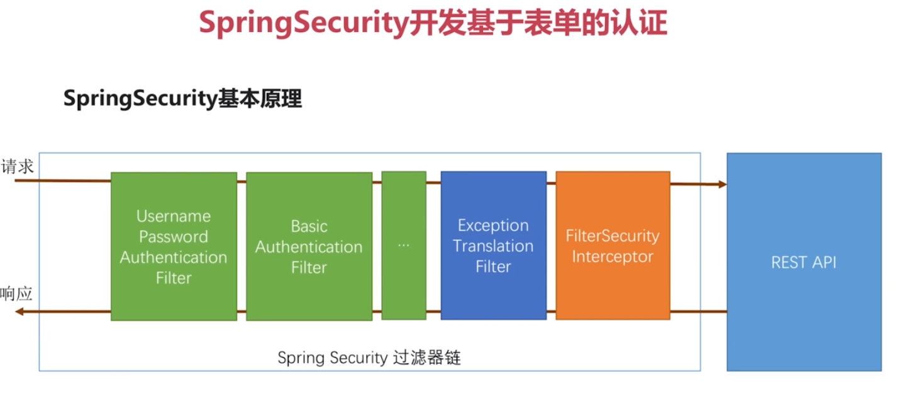
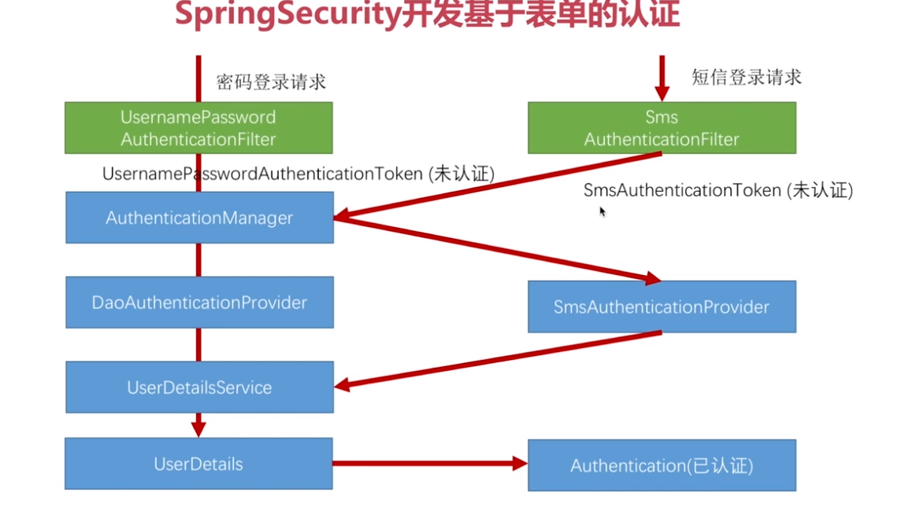
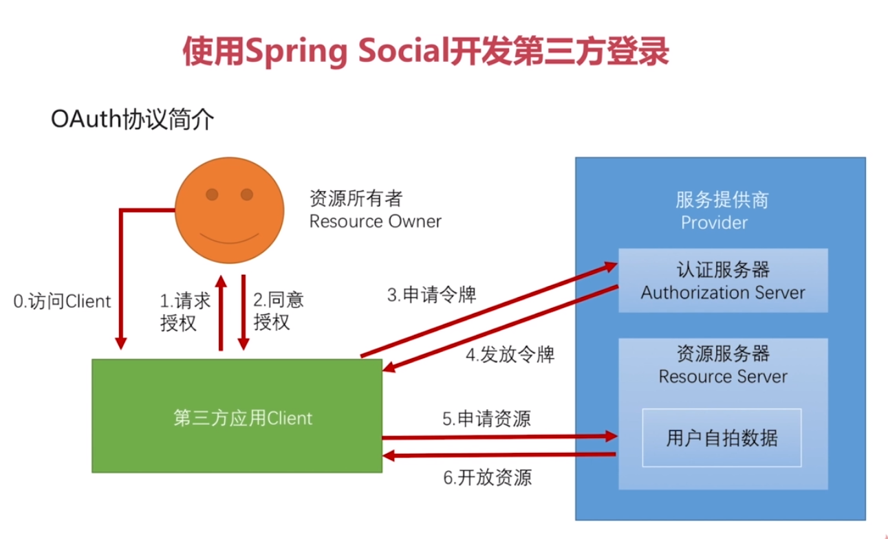
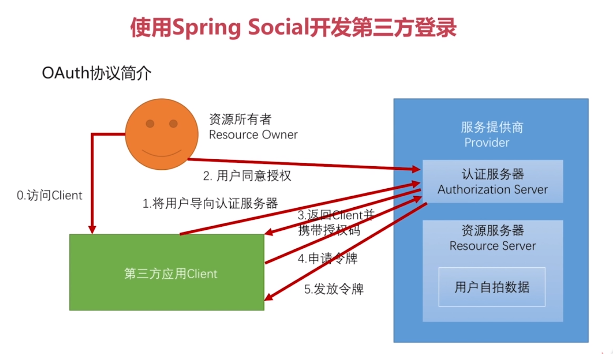
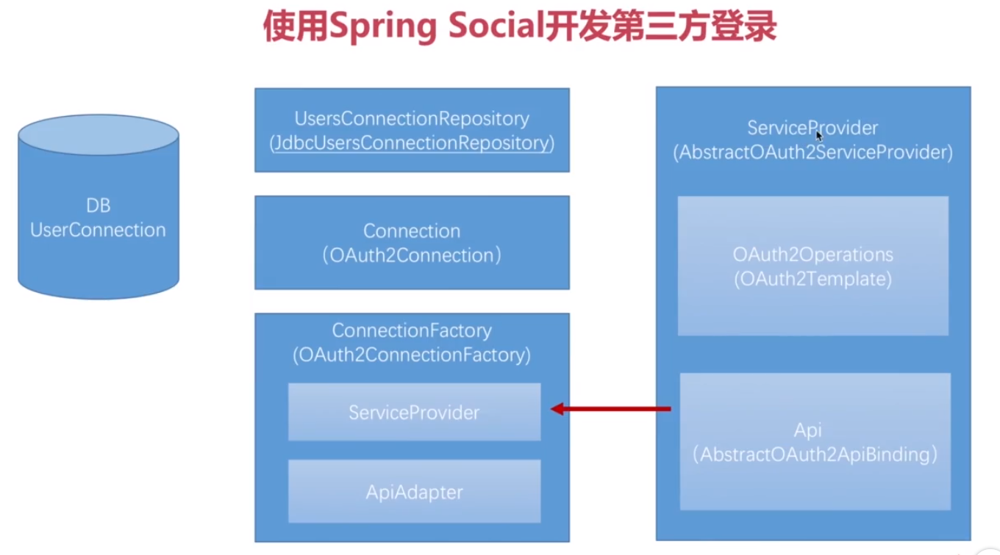

#### Spring Security 
此外还有关于异步处理/hibernate validation/文件上传下载/拦截器等/swagger等,在AsyncResult.md

#### 关于设计模式在项目开发中运用的感想
        关于设计模式,我曾经照着一篇博客,敲打过几乎常用的所有设计模式.然后在项目中真正运用得并不多.
    我还记得那个博主写的一句话,最常用的是模版方法模式.我并无他想.
        直到前些天,我开发公司的一个短信发送平台时,因为需要接入多个短信发送渠道,并且以后需要能扩展渠
    道(这周就在新加一个渠道.移动的CMPP协议,贼难受).我就一直尽量在编写代码时将其设计的比较抽象,并尽
    可能地消除了一些后期可能需要改动的if语句;例如使用表驱动(类似一个数组或map,使用索引或key选择实现
    类)这样子的;
        刚开始时,我并没有使用其他设计模式的想法.在我按部就班地写完第一个渠道的发送方法(无非就是获取
    发送参数,封装成请求参数,发送,处理同步返回值等(当然该系统还有其他比较繁琐的逻辑)),突然就顿悟了,
    稍稍重构了下代码,将其重构成了模版方法.顿时后面的代码都十分简单了.然后在异步回调,短信上行的处理中
    ,我全部使用了模版方法.终于体会到他的强大.简单而强大.
        此外,近来我也细细想过.对于一个并无扩展需求的业务系统来说,设计模式或者说抽象的编程真的没什么
    必要.就拿目前简直是行业规范的service层接口来说把,哪个业务系统会需要把整个service层的实现全部替
    换了.将其抽象出接口来,简直就是给开发找麻烦.
        以我目前的理解,设计模式最好的运用场合是在写轮子的时候.将应用的逻辑进行分层,将有自定义需求的
    所有逻辑抽象出来,方便以后自定义的扩展才是正解.   

#### bug记录
* 如果出现idea父模块无法导入子模块，可以在设置里面搜索maven，找到忽略的文件，去掉该子模块的勾选即可。
* 如果导入后，发现还是未解决问题，可以打开idea的maven project，选中该项目，刷新即可
* SpringMVC中RequestMapping("/")这个/不能乱加,如果controller类已经有/user这样一个前缀,  
那么如果在方法上在注解上"/",访问的路径就会为/user/,使用/user将无法访问
* !!!之前遇到HttpClient发送json串请求controller方法,参数一直为null.是因为没有加@RequestBody.
* !!!spring boot 属性注入 @ConfigurationProperties 必须有getter/setter方法才能生效 血泪教训

#### 奇淫巧技

* PasswordEncoder类,可以直接用来加密解密

* ServletWebRequest类,可以封装request和response.

* 如下写法,可以将spring容器中所有该类型的bean都放入map中,并以每个bean各自的name为key:  
>
    @Auwired
    private Map<String,User> userMap;
>

* 如下写法,可以用来自定义配置bean:  
写轮子的时候用,如果调用者没有配置自己的bean,才使用轮子默认的bean,除了name外,还可以使用type等
>
    //该注解表示将在该类中使用@Bean配置bean,相当于用java代码写原先的spring.xml中的beans标签配置bean
    @Configuration
    public class CaptchaBeanConfig {
        @Autowired
        private SecurityProperties securityProperties;
        //当spring在容器中无法找到名字为imageCaptchaGenerator的bean的时候,才使用该方法生成bean
        @Bean
        @ConditionalOnMissingBean(name = "imageCaptchaGenerator")
        public CaptchaGenerator imageCaptchaGenerator() {
            //创建默认的图片验证码生成器
            BasicImageCaptchaGenerator imageCaptchaGenerator = new BasicImageCaptchaGenerator();
            imageCaptchaGenerator.setSecurityProperties(securityProperties);
            return imageCaptchaGenerator;
        }
    }
>

* 实现InitializingBean,并重写方法,可以在所有bean初始化完毕时,执行某些操作

* ServletRequestUtils工具.如下方法可以从request获取指定类型的指定key的参数值,如果取不到就用默认值:
>
    ServletRequestUtils.getIntParameter(
                    request.getRequest(),
                    "width",
                    securityProperties.getCaptcha().getImage().getWidth());
>

* 在resources目录中,新建resources目录.并写一个index.html.可以访问url/index.html直接访问到

* ObjectMapper : springMVC在启动时自动注册的bean,用于将对象转为json,可以直接注入到代码中

* ctrl + h ,类的继承图;

* 使用MediaType(spring的),几乎有所有常用的http请求的contentType属性的值的常量:  
例如MediaType.APPLICATION_JSON_UTF8_VALUE

* 使用TimeUnit.SECONDS.sleep(x);可以使用秒..暂停线程.

* 在idea的MavenProject窗口选择module，右击选择show dependencies,可以很清楚地查看依赖关系图

* 如下,可以获取classpath目录的路径(该路径为classes下的resources路径):  
ClassPathResource resource = new ClassPathResource("mock/response/01.json");
resource.getFile();

* Commons-lang包中有RandomStringUtils可以生成随机数

* 在@ControllerAdvice注解的类中的@ExceptionHandle注解的方法上,可以使用如下注解返回指定状态码:  
@ResponseStatus(HttpStatus.INTERNAL_SERVER_ERROR)

* JsonPath:在github中的一个项目，可以用类似jquery选择器那样的语法，取出一个json中任意的信息。

* 在spring mvc中使用url传参时,可以指定参数的正则表达式(如下就是指定id必须为数字):    
@GetMapping("/user/{id:\\d+}")  
注意,如果传参不符合该正则,返回的状态码将是404

* 使用如下代码，可以在不动实体类的情况下，发射实体类的toString方法：  
ReflectionToStringBuilder.toString(userQueryCondition, ToStringStyle.MULTI_LINE_STYLE);  
直接sout上面的表达式即可输出；  

* 如果在controller中使用springDataJpa的pageable对象接收分页参数，可以用如下注解，来指定其默认值：  
@PageableDefault(size = 10,page = 0,sort = "username,asc") Pageable pageable

#### 搭建环境
1. 新建项目zx-security
2. 在该项目下，建立四个子模块  
    * app
    * browser
    * core
    * demo
3. 在zx-security该父模块下添加依赖:  
>
    <dependencyManagement>
        <dependencies>
            <!--管理spring的版本-->
            <dependency>
                <groupId>io.spring.platform</groupId>
                <artifactId>platform-bom</artifactId>
                <version>Brussels-SR4</version>
                <type>pom</type>
                <scope>import</scope>
            </dependency>
            <dependency>
                <groupId>org.springframework.cloud</groupId>
                <artifactId>spring-cloud-dependencies</artifactId>
                <version>Dalston.SR2</version>
                <type>pom</type>
                <scope>import</scope>
            </dependency>
        </dependencies>
    </dependencyManagement>
>
和编译插件：
>
    <build>
        <plugins>
            <plugin>
                <groupId>org.apache.maven.plugins</groupId>
                <artifactId>maven-compiler-plugin</artifactId>
                <version>2.3.2</version>
                <configuration>
                    <source>1.8</source>
                    <target>1.8</target>
                    <encoding>UTF-8</encoding>
                </configuration>
            </plugin>
        </plugins>
    </build>    
>
4. 在zx-security-core子模块中增加依赖(自行查看)
5. 然后在app模块中加入core模块的依赖:
>
        <dependency>
            <groupId>com.zx.security</groupId>
            <artifactId>zx-security-core</artifactId>
            <version>${zx.security.version}</version>
        </dependency>
>
注意，该version是写在父模块中的，可直接引用
6. 在browser中加入依赖：
>
        <dependency>
            <groupId>com.zx.security</groupId>
            <artifactId>zx-security-core</artifactId>
            <version>${zx.security.version}</version>
        </dependency>
        <dependency>
            <groupId>org.springframework.session</groupId>
            <artifactId>spring-session</artifactId>
        </dependency>
>
7. 在demo中依赖：
>
        <dependency>
            <groupId>com.zx.security</groupId>
            <artifactId>zx-security-browser</artifactId>
            <version>${zx.security.version}</version>
        </dependency>
>

#### Hello World
1. 在demo中新建com.zx包，然后新建DemoApplication类，并加入@SpringBootApplication注解等。  
写到这的时候，我才意识到，这就是springBoot项目不依赖spring为父模块，而是依赖自定义的父模块的写法。
2. 直接在该Application类上写@RestController，然后写个/test
3. 新建application.yml,配置如下(如果不关闭security,默认用户名为user,密码为启动时输出的一串默认密码):
>
spring:
  datasource:
    driver-class-name: com.mysql.jdbc.Driver
    url: jdbc:mysql://127.0.0.1:3306/zx-security?useUnicode=yes&characterEncode=UTF-8
    username: root
    password: 123456
  session:
    store-type: none  #暂时关闭spring-session的配置，不然会报错
  security:
    basic:
      enabled: false #暂时关闭spring-security的配置，不然会报错
  
>
4. 注意，此时如果将demo项目打包，只会是一个普通的jar，无法直接运行启动spring boot，  
还需要在pom.xml中加入，才可以将它包含的依赖一起打包，以便直接用jar运行spring boot,  
包名就是finalName:
>
    <build>
        <plugins>
            <plugin>
                <groupId>org.springframework.boot</groupId>
                <artifactId>spring-boot-maven-plugin</artifactId>
                <executions>
                    <execution>
                        <goals>
                            <goal>repackage</goal>
                        </goals>
                    </execution>
                </executions>
            </plugin>
        </plugins>
        <finalName>Demo</finalName>
    </build>
>

#### Restful
* 用URL描述资源
* 用HTTP方法描述行为
* 用HTTP状态码表示不同的结果
* 用json交互数据
* 资源表达中包含了链接信息，也就是返回的json中包含其他的api url（一般达不到该要求）
例如：
>
/user?name=zx   GET     查名字
/user/1         GET     查id
/user           POST    增
/user/1         DELETE  删
/user/1         PUT     改
>

#### Web层测试用例编写
1. 在demo项目引入依赖:
>
        <dependency>
            <groupId>org.springframework.boot</groupId>
            <artifactId>spring-boot-starter-test</artifactId>
        </dependency>

>

2. 编写如下测试类即可测试controller的代码:
>
    @SpringBootTest
    @RunWith(SpringRunner.class)
    public class UserControllerTest {
        //spring的web容器
        @Autowired
        private WebApplicationContext wac;
    
        //mvc模拟类
        private MockMvc mockMvc;
    
        //使用容器构建mvc模拟类
        @Before
        public void setup() {
            mockMvc = MockMvcBuilders.webAppContextSetup(wac).build();
        }
    
        @Test
        public void whenQuerySuccess() throws Exception {
            /**
             * 向/user发起get请求，其中header的contentType为json，参数自定义
             * 并且期望，返回的http状态码为200，
             * 并且期望，将返回的json解析后，数组长度为3
             */
            mockMvc.perform(MockMvcRequestBuilders.get("/user")
                    .contentType(MediaType.APPLICATION_JSON_UTF8)
                    .param("username", "zx"))
                    .andExpect(MockMvcResultMatchers.status().isOk())
                    .andExpect(MockMvcResultMatchers.jsonPath("$.length()").value(3));
        }
    }
>

#### @JsonView使用-注意,指定视图后,对象所有属性都需指定视图,否则将不会返回
1. 将要返回成json串的实体类,进行改造:  
创建不同的视图,每个视图代表一个controller的方法,区分每个方法返回时,该对象该返回的属性和不返回的属性.  
以往我的写法都是创建多个返回的dto对象,显得很_麻瓜
>
    @Data
    @AllArgsConstructor
    @NoArgsConstructor
    public class User {
    
        //用户简单视图
        public interface UserSimpleView {};
    
        //用户详情视图
        public interface  UserDetailView extends UserSimpleView {};
    
        //将该属性在简单视图展示
        @JsonView(UserSimpleView.class)
        private String username;
    
        //将密码属性在详情视图才展示,
        // 但是详情视图仍然会显示简单视图的属性,因为有一个继承关系
        @JsonView(UserDetailView.class)
        private String password;
    }
>

2. 在controller层的方法上增加如下注解,即可返回指定视图:  
@JsonView(User.UserSimpleView.class)

#### SpringSecurity基本原理

* 过滤器链
    * 身份验证过滤器(任意一种该过滤器通过后即可),可通过配置决定某一过滤器是否生效(其他过滤器则不行)
        * UsernamePasswordAuthenticationFilter-处理表单登录
        * BasicAuthenticationFilter-处理basic(最原始的弹出框)登录
    * ExceptionTranslationFilter-捕获FilterSecurityInterceptor抛出的异常,作相应处理
    * 最后一个过滤器(之后就是真正的方法了)
        * FilterSecurityInterceptor-真正决定当前请求能否访问

#### SpringSecurity表单验证demo-以上的基本都是demo模块,往下开始在browser模块
1. 在browser模块中新建BrowserSecurityConfig,如下:
>
    @Configuration
    public class BrowserSecurityConfig extends WebSecurityConfigurerAdapter{
    
        @Override
        protected void configure(HttpSecurity http) throws Exception {
            http
    //                .httpBasic()//最原始的弹出框登录,二选一
                    .formLogin()//表单页面登录,二选一
                    .and()
                    .authorizeRequests()//进行验证配置
                    .anyRequest()//任何请求
                    .authenticated();//都需验证
    
        }
    }
>
2. 因为demo模块依赖了browser模块,所以此时再次启动demo模块
3. 访问任何url,都会进入一个表单验证界面,需要输入帐号密码才可

* 用户信息获取
    * 重写UserDetailsService接口,从数据库中加载用户信息及权限

* 处理用户逻辑
    * 在UserDetailsService接口中返回的UserDetails接口对象  
    有几个校验方法
        * isAccountNonExpired()是否没有过期
        * isCredentialsNonExpired()认证(密码)是否过期
        * isAccountNonLocked()是否没有锁定
        * isEnabled()是否可用/被删除
    * 在构造User对象时,可以传入上面这些校验方法的boolean值
    * 可以自定义实现UserDetails接口

* 处理密码加密解密
    * 使用PasswordEncoder类(crypto包中的)
        * encode()加密密码;该方法需要我们在存入密码时调用
        * match()判断加密后密码是否匹配;security框架自行调用
    * 在BrowserSecurityConfig类中配置一个bean,返回PasswordEncoder,  
    使用已有的BCryptPasswordEncoder类,其BCrypt加密比MD5安全,但性能稍低:
    >
            @Bean
            public PasswordEncoder passwordEncoder() {
                return new BCryptPasswordEncoder();
            }
    >
    * 该BCryptPasswordEncoder类极其强大,即使是相同密码,每次生成的密文都不相同,  
    因为每个密文中还携带了不同的盐salt;
    
4. BrowserSecurityConfig类配置:
>
        @Override
        protected void configure(HttpSecurity http) throws Exception {
            http
    //                .httpBasic()//最原始的弹出框登录,二选一
                    .formLogin()//表单页面登录,二选一
                    .loginPage("/login.html")//登录页面url
                    .loginProcessingUrl("/login")//登录方法url,默认就是/login,用post方法
    
                    .and()
                    .authorizeRequests()//进行验证配置
    
                    .antMatchers("/login.html")//匹配这些路径
                    .permitAll()//全部允许
    
                    .anyRequest()//任何请求
                    .authenticated();//都需验证
    
            http.csrf().disable();//暂时关闭csrf,防止跨域请求的防护关闭
        }
>

5. 配置BrowserSecurityController,也就是进入登录页面的方法逻辑:
>
       /**
         * 当访问的页面需要验证时,security会跳转到下面这个接口的登录页面,
         * 但会把真正要访问的页面,也就是跳转前的页面存到cache中
         */
        private RequestCache requestCache = new HttpSessionRequestCache();
    
        /**
         * 重定向策略,用于跳转请求
         */
        private RedirectStrategy redirectStrategy = new DefaultRedirectStrategy();
    
        @Autowired
        private SecurityProperties securityProperties;
    
        /**
         * 当需要身份认证时,跳转到这里
         *
         * 其需求是.如果之前访问的url不是页面,就返回异常信息;如果是页面,就跳转到登录页;
         * 此处是用访问的后缀是不是.html结尾来判断的,
         * 我觉得比较好的是,根据请求头的context-type来判断.
         * 就是这个:
         *  @RequestMapping(
         *       produces = {"text/html"}
         *   )
         * @param request
         * @return
         */
        @RequestMapping("/view/login")
        @ResponseStatus(code = HttpStatus.UNAUTHORIZED)//返回401,未授权状态码
        public SimpleResponse requiredAuthentication(HttpServletRequest request, HttpServletResponse response) throws IOException {
            //获取到跳转前的请求
            SavedRequest savedRequest = requestCache.getRequest(request, response);
    
            //如果请求不为空
            if (savedRequest != null) {
                //获取到请求url
                String target = savedRequest.getRedirectUrl();
                log.info("引发跳转的请求是:{}", target);
                //如果该请求是.html结尾的,跳转到登录页,否则表示不是请求的页面,返回json
                if (StringUtils.endsWithIgnoreCase(target, ".html")) {
                    //跳转到登录页,从yml配置中读取登录页路径
                    redirectStrategy.sendRedirect(request,response,securityProperties.getBrowser().getLoginPage());
                }
            }
            return new SimpleResponse("访问的服务需要身份认证,请引导用户到登录页");
        }
>

6. 在core模块中添加配置属性bean-SecurityProperties,其中包括了BrowserProperties
>
    @Data
    @ConfigurationProperties(prefix = "zx.security")
    public class SecurityProperties {
        private BrowserProperties browser = new BrowserProperties();
    }
    
    @Data
    public class BrowserProperties {
            //登录页配置-默认值
            private String loginPage = "/login.html";
    }
>
这样,配置在demo模块的yml中的如下就会被读取到SecurityProperties类的browser中的loginPage中
>
    zx:
      security:
        browser:
          loginPage: /login1.html
>
然后再配置一个(我他妈从来没配置过?????!!!!),让上面的属性读取类生效
(然后将这个loginPage属性注入到BrowserSecurityController还有BrowserSecurityConfig中去)
>
    @Configuration
    @EnableConfigurationProperties(SecurityProperties.class)
    public class SecurityCoreConfig {
    }
>

7. 修改登录成功后的处理方式:
自定义身份验证成功处理类
>
    /**
     * author:ZhengXing
     * datetime:2017-11-24 20:40
     * 自定义身份验证成功处理器
     * security默认在验证成功后跳转到此前访问的页面,但是如果前端的登录是
     * ajax方式的,不适合跳转页面,所以需要更改成功后的处理
     */
    @Component("customAuthenticationSuccessHandler")
    @Slf4j
    public class CustomAuthenticationSuccessHandler implements AuthenticationSuccessHandler{
        /**
         * springMVC在启动时自动注册的bean,用于将对象转为json
         */
        @Autowired
        private ObjectMapper objectMapper;
        /**
         * 当登陆成功时
         * @param request
         * @param response
         * @param authentication 封装了认证信息
         */
        @Override
        public void onAuthenticationSuccess(HttpServletRequest request, HttpServletResponse response, Authentication authentication) throws IOException, ServletException {
            log.info("登录成功");
            response.setContentType(MediaType.APPLICATION_JSON_UTF8_VALUE);
            //将authentication对象转为jsonString,返回
            response.getWriter().write(objectMapper.writeValueAsString(authentication));
        }
    }
>
在BrowserSecurityConfig配置处理类:
>
    .successHandler(customAuthenticationSuccessHandler)//配置验证成功处理器
>
如下是handler的方法中的authentication对象的一些属性:
>
    {
    authorities: [
    {
    authority: "admin"   
    }
    ],
    details: {
    remoteAddress: "127.0.0.1",
    sessionId: "24AC42B2747541800EB5C4744AF2CEF0"
    },
    authenticated: true,
    principal: {
    password: null,
    username: "aaa",
    authorities: [
    {
    authority: "admin"
    }
    ],
    accountNonExpired: true,
    accountNonLocked: true,
    credentialsNonExpired: true,
    enabled: true
    },
    credentials: null,
    name: "aaa"
    }
>

8. 修改登录失败后的处理方式:
自定义处理器:
>
    /**
     * author:ZhengXing
     * datetime:2017-11-24 21:03
     * 自定义身份验证失败处理器
     */
    @Component("customAuthenticationFailHandler")
    @Slf4j
    public class CustomAuthenticationFailHandler implements AuthenticationFailureHandler {
    
        @Autowired
        private ObjectMapper objectMapper;
    
        /**
         * 在异常中,有错误消息,是关于为什么登录失败的
         * 
         * 默认登录失败是跳转到一个登录失败的url,此处改了处理方式
         */
        @Override
        public void onAuthenticationFailure(HttpServletRequest request, HttpServletResponse response, AuthenticationException e) throws IOException, ServletException {
            log.info("登录失败");
            //状态码500
            response.setStatus(HttpStatus.INTERNAL_SERVER_ERROR.value());
            response.setContentType(MediaType.APPLICATION_JSON_UTF8_VALUE);
            //将authentication对象转为jsonString,返回
            response.getWriter().write(objectMapper.writeValueAsString(e));
        }
>
配置处理器:
>
    .failureHandler(customAuthenticationFailHandler)//配置验证失败处理器
>
在处理器的异常中,有对应的失败消息

9. 将使用默认的重定向还是使用自定义的json返回处理方式加入配置属性,可自定义配置  
增加登录类型枚举,并在BrowserProperties属性类中增加对应属性:
>
    public enum LoginType {
        //重定向
        REDIRECT,
        //返回json
        JSON,
        ;
    }
>
然后在成功和失败处理器中,都将原来的实现成功失败处理接口,改为继承security默认的处理器实现类,然后重写对应方法:  
根据类型选择自定义实现还是使用父类默认的方法
>
    //如果配置的的登录方式是json,使用自定义处理器
            if(LoginType.JSON.equals(securityProperties.getBrowser().getLoginType())){
                response.setContentType(MediaType.APPLICATION_JSON_UTF8_VALUE);
                //将authentication对象转为jsonString,返回
                response.getWriter().write(objectMapper.writeValueAsString(authentication));
            }else{
                //否则使用父类处理方法,重定向
                super.onAuthenticationSuccess(request,response,authentication);
            }
>
如下配置即可:
>
    zx:
      security:
        browser:
          #配置登录方式
          loginType: REDIRECT
>

#### 认证流程源码级详解
* 点击登录,进入UsernamePasswordAuthenticationFilter类
* 在该类的attemptAuthentication()方法中获取到请求的用户名密码
* 用用户名密码构建了UsernamePasswordAuthenticationToken对象
* 该对象是Authentication接口的实现.
* ...下次有时间自己看吧
* 对于如何在多个对象间共享用户认证信息,用的是SecurityContextHolder,  
其本质还是ThreadLocal

#### 在Controller中获取登录用户的信息
>
        /**
         * 获取用户信息
         */
        @GetMapping("/me")
        public Object getCurrentUser(@AuthenticationPrincipal UserDetails user) {
            //一种方法是自己获取
            //SecurityContextHolder.getContext().getAuthentication()
    
            //第二种方式
            //直接在方法参数中写Authentication,即可获取
    
            //第三种,只想获取Authentication中的UserDetails
            //在方法参数中这么写@AuthenticationPrincipal UserDetails user
    
            return user;
        }
>

#### 从session中获取用户信息
* 存储在session中的SPRING_SECURITY_CONTEXT 这个key中.
* Session.SPRING_SECURITY_CONTEXT.authentication.principal.username

#### 扩展UserDetails
* 实现如下类,然后在自定义的UserDetailService中新建该类即可
* 注意,在获取时可以使用 @AuthenticationPrincipal CustomUser user, 在方法上直接使用自定义的类来接收
>
    /**
     * author:ZhengXing
     * datetime:2017/12/12 0012 12:08
     * 自定义用户类
     */
    @Data
    @NoArgsConstructor
    @AllArgsConstructor
    public class CustomUser implements UserDetails {
    
    	private Long id;
    
    	private String username;
    
    	private String password;
    
    	private Boolean enabled;
    
    	private Collection<? extends GrantedAuthority> authorities;
    
    	public CustomUser(Long id, String username, String password, Boolean enabled) {
    		this.id = id;
    		this.username = username;
    		this.password = password;
    		this.enabled = enabled;
    	}
    
    	@Override
    	public Collection<? extends GrantedAuthority> getAuthorities() {
    		return null;
    	}
    
    	@Override
    	public String getPassword() {
    		return password;
    	}
    
    	@Override
    	public String getUsername() {
    		return username;
    	}
    
    	@Override
    	public boolean isAccountNonExpired() {
    		return true;
    	}
    
    	@Override
    	public boolean isAccountNonLocked() {
    		return true;
    	}
    
    	@Override
    	public boolean isCredentialsNonExpired() {
    		return true;
    	}
    
    	@Override
    	public boolean isEnabled() {
    		return enabled;
    	}
    }
>

#### 图形验证码
* 新建Captcha类,保存验证码的图片流/code/过期时间
* 完成captchaController,生成图片并返回
* 在securityConfig配置类中,允许未登录便访问获取验证码的路径
* 自定义CaptchaFilter过滤器,并将其加入security配置中

* 重构
* 将验证码的大小/字符数/需要验证的url/生成方法都变成可配置的

#### Remember记住我功能
* 基本原理
    * 在UsernamePasswordAuthenticationFilter认证成功后,  
    调用RememberService的TokenRepository,将token生成并写入cookie和数据库
    * 用户下次访问时,访问到RememberMeAuthenticationFilter,  
    读取到cookie中的token,从数据库中查询到对应token的用户名,  
    然后使用UserDetailsService找到用户信息,完成登录验证

* 在登录页面中增加记住我的选择,使用remember-me为name:  
<input type="checkbox" name="remember-me" value="true">

* 在BrowserSecurityConfig类中如下配置:  
Bean:
>
        @Autowired
        private DataSource dataSource;
        //记住我功能的配置,需要注入
        @Autowired
        private UserDetailsService customUserDetailsService;
        /**
         * 记住我功能
         * 生成用来将token写入数据库的PersistentTokenRepository类
         */
        @Bean
        public PersistentTokenRepository persistentTokenRepository() {
            JdbcTokenRepositoryImpl tokenRepository = new JdbcTokenRepositoryImpl();
            tokenRepository.setDataSource(dataSource);
            //设置在启动时,创建对应的数据库中存储token的表
            tokenRepository.setCreateTableOnStartup(true);
            return tokenRepository;
        }
>
配置:
>
    .and()
       .rememberMe()//配置记住我功能
           //token仓库配置,用来将token存入数据库
           .tokenRepository(persistentTokenRepository())
           //token过期秒数配置
           .tokenValiditySeconds(securityProperties.getBrowser().getRememberMeSeconds())
           //查询用户信息的service
           .userDetailsService(customUserDetailsService)
>

* 启动后,会自动在数据库中创建persistent_logins表

* 然后登录,此时,该表中会多一条记录,保存了该用户的用户名/session/token/最后登陆时间;  
然后我们关闭程序,重新启动程序,此时,之前登录的session应该无效了;  
直接访问需要验证的url,会发现已经无需登录了

#### 短信验证码登录-security框架外的东西(core-com.zx.security.validate)
* 完成除security框架外的代码后,目前是这个架构:
    * 在controller中有两个方法,分别实现图形/短信验证码
    * 有图形/短信验证码生成器接口和两个实现类
    * 图形验证码需要用流输出回去,短信验证码需要调用短信验证码发送器接口的方法.
* 可使用模版方法重构为如下逻辑(我真的懒得重构了(...最终还是重构了,难受))
    * controller中只有一个方法,使用url传参,得到验证码类型是短信还是图形
    * 定义了一个验证码处理接口和验证码处理接口抽象类
    * 实现了 生成验证码 -> 存储验证码 -> 发送验证码/返回图片流 整个的模版方法,每一步不同的划分为各自的抽象方法
    * 两个实现抽象类的实现类,分别完成各自不同的方法就可以了,
        * 图片验证码返回流
        * 短信验证码发送短信

* 短信验证码流程

#### 短信验证码登录-扩展security框架(core-com.zx.security.authentication.mobile)
* 实现自己的SmsCaptchaAuthenticationToken类(Authentication的子类):  
用于在未认证通过时存放手机号,通过时,存放用户信息

* 实现SmsCaptchaAuthenticationFilter类,  
用于从请求中获取手机号,其他关于请求的详细信息,将其存入SmsCaptchaAuthenticationToken等

* 实现SmsCaptchaAuthenticationProvider类,  
使用userDetailsService.loadUserByUsername验证其身份,设定自己这个Provider支持哪些Authentication,  
如果身份验证通过了,将其用户信息和之前的详细信息,存到新的SmsCaptchaAuthenticationToken中,返回

* 实现SmsCaptchaFilter过滤器,来在最开始验证短信验证码是否正确,基本就复制图形验证码的过滤器,稍微改下即可

* 在core中新建SmsCaptchaAuthenticationSecurityConfig,配置上面的实现类;  
并在BrowserSecurityConfig中,同样配置SmsCaptchaFilter;  
并在BrowserSecurityConfig中如下配置:
>
    .and()
        .apply(smsCaptchaAuthenticationSecurityConfig);
>

* 全部实现后,可重构的包括两个类似的验证码过滤器,需要相同引用的变量抽成常量,  
将security配置类分为app配置/web配置/验证码配置等各个类,放到各自模块..  
这些我是真的懒得打了... 

#### OAuth2协议
* 角色
    * client: 第三方服务
    * Resource Owner: 资源所有者,也就是用户
    * Provider: 服务提供商-例如QQ这样我们需要他的用户信息的提供商
        * Authorization: 认证服务器,用来获取token
        * Resource Server: 资源服务器,用token来获取client授权了的资源
* 普通流程

* OAuth协议中的授权模式
    * 授权码模式
    * 密码模式
    * 客户端模式
    * 简化模式
    
* 授权码模式

与其他模式的区别在于,  
其他模式同意授权的动作是在第三方应用上完成的,该模式在认证服务器上完成;    
用户同意授权后,该模式中认证服务器返回第三方的是一个授权码,而不是直接返回令牌.

#### Spring Social

* 其基本原理就是在最后一步,用户通过token获取到用户信息后,  
    在SpringSecurity中,将用户信息构建成Authentication,并放入Security,也就相当于登录成功了.  

* Social框架将这么一个流程封装到了一个SocialAuthenticationFilter过滤器中,  
    然后将该过滤器加到了SpringSecurity的过滤器链中.

* ServiceProvider(AbstractOAuth2ServiceProvider):服务提供商的抽象,
针对不同的服务提供商,例如QQ/微信,需要继承并实现不同的类

* OAuth2Operations(OAuth2Template):操作接口,封装了OAuth2协议,从用户授权到获取令牌的所有流程

* Api(AbstractOAuth2ApiBinding):自行实现的接口,根据服务提供商提供获取用户信息这也样一个行为

* Connection(OAuth2Connection):封装获取到的用户信息

* ConnectionFactory(OAuth2ConnectionFactory):创建Connection实例,也就是在这个工厂中,为了创建  
    Connection,包含了ServiceProvider,包括上面这些步骤,都是通过该类调用,知道最后一步获取到用户信息,  
    然后该类创建Connection.
* ApiAdapter:在Api和Connection之间做一个适配,将每个服务提供商提供的不同的用户信息适配

* DBUserConnection:Social提供的一张数据库表,存储了自己系统里的普通用户和服务提供商获取的用户的一个  
    对应关系.由此,可以在第三方登录的时候,知道是哪个本地用户登录了

* UserConnectionRepository(JdbcUsersConnectionRepository):用来操作DBUserConnection表

#### 再次整理下上面的逻辑
* 我们需要的是Connection(OAuth2Connection),也就是用户信息.
* 获取用户信息,需要ConnectionFactory(OAuth2ConnectionFactory).该工厂封装了所有步骤.
* 构建这个工厂,需要ServiceProvider(AbstractOAuth2ServiceProvider)服务提供商
和ApiAdapter适配器,适配获取用户信息的Api(AbstractOAuth2ApiBinding)接口和Connection用户信息
* 而为了构建ServiceProvider服务提供商,就需要OAuth2Operations(OAuth2Template):操作接口(从用户授权到获取令牌的所有流程)
和Api(AbstractOAuth2ApiBinding)根据服务提供商提供获取用户信息这也样一个行为的接口
* 所以,最根本的实现是从底层的API接口开始,一步一步往上走

#### 开始开发第三方登录 :zx-security-core
* Api(AbstractOAuth2ApiBinding):QQ接口:QQImpl实现类:获取用户信息.
>
    定义QQ接口,定义获取用户信息方法.
    定义QQImpl类,实现QQ接口,并继承AbstractOAuth2ApiBinding类.
    
    AbstractOAuth2ApiBinding类中.
    有accessToken(令牌)属性,用来向服务提供商换取用户信息(授权码模式第6步).
    因为该属性,每个用户都是不同的,所以QQImpl不是单例对象,每次进行第三方登录时,都会创建一个QQImpl;
    还有一个RestTemplate类.用来发送http请求.获取用户信息.
    
    在qq的文档中.获取用户信息,需要三个参数.其中的令牌就是accessToken.
    所以只需要再在QQImpl中添加上剩余的两个参数appId和openId即可.
    
    此外还有两个路径.
    一个就是根据这三个参数获取用户信息的路径.
    还一个是用accessToken获取用户openId的路径.
    
    然后具体逻辑见该类注释
>

* OAuth2Operations(OAuth2Template):操作接口,封装了OAuth2协议,从用户授权到获取令牌的所有流程;  
该类暂时使用spring social 的默认实现.

* ServiceProvider(AbstractOAuth2ServiceProvider):服务提供商的抽象.
>
    定义QQServiceProvider,实现AbstractOAuth2ServiceProvider接口.
    实现了其创建QQImpl的抽象方法和 注入 OAuth2Operations(OAuth2Template)的构造方法.
    
    具体见该类注释
>
 