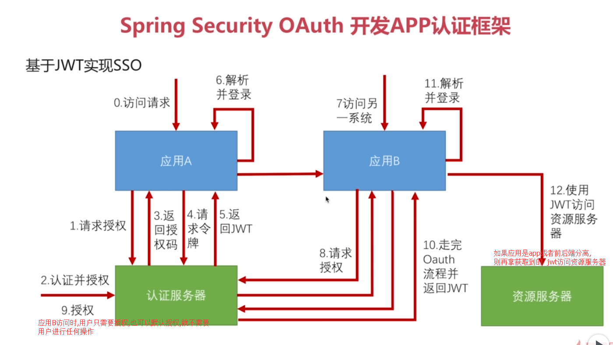

#### 基于JWT实现SSO
* SSO:单点登录. 在A网站登陆后,访问B网站.也将是登录状态

* 如上流程中,应用A和B,并不一定要使用SpringSecurity或者是Java编写.
因为只需要能发送http请求,解析JWT即可.
* 此处不再在原来项目上修改,新建sso相关模块

#### 创建项目
* sso-demo  sso相关项目的父项目
    * 该模块不再继承zx-security.
    * 将zx-security的pom.xml中的依赖等copy到该项目的pom.
* sso-server sso认证服务器
    * 引入依赖
        >
                <dependency>
                    <groupId>org.springframework.boot</groupId>
                    <artifactId>spring-boot-starter-security</artifactId>
                </dependency>
                <dependency>
                    <groupId>org.springframework.boot</groupId>
                    <artifactId>spring-boot-starter-web</artifactId>
                </dependency>
                <dependency>
                    <groupId>org.springframework.security.oauth</groupId>
                    <artifactId>spring-security-oauth2</artifactId>
                </dependency>
                <dependency>
                    <groupId>org.springframework.security</groupId>
                    <artifactId>spring-security-jwt</artifactId>
                </dependency>     
        >
    * 配置该配置类,开启认证服务器
        >
            /**
             * author:ZhengXing
             * datetime:2018-01-13 14:22
             *
             * 认证服务器配置类
             */
            @Configuration
            @EnableAuthorizationServer
            public class SsoAuthorizationServerConfig extends AuthorizationServerConfigurerAdapter {
            
                /**
                 * 配置两个应用client1 和 client2
                 */
                @Override
                public void configure(ClientDetailsServiceConfigurer clients) throws Exception {
                    clients.inMemory()
                            .withClient("client1")
                            .secret("123456")
                            .authorizedGrantTypes("authorization_code","refresh_token")
                            .scopes("all")
                            .and()
                            .withClient("client2")
                            .secret("123456")
                            .authorizedGrantTypes("authorization_code","refresh_token")
                            .scopes("all");
                }
            
                /**
                 * jwt令牌存储
                 */
                @Bean
                public TokenStore jwtTokenStore() {
                    return new JwtTokenStore(jwtAccessTokenConverter());
                }
            
                /**
                 * jwt令牌生成
                 */
                @Bean
                public JwtAccessTokenConverter jwtAccessTokenConverter() {
                    JwtAccessTokenConverter jwtAccessTokenConverter = new JwtAccessTokenConverter();
                    //签名 防篡改 用的密钥
                    jwtAccessTokenConverter.setSigningKey("zx");
                    return jwtAccessTokenConverter;
                }
            
                /**
                 * 认证服务器服务端配置
                 */
                @Override
                public void configure(AuthorizationServerEndpointsConfigurer endpoints) throws Exception {
                    endpoints
                            .tokenStore(jwtTokenStore())
                            .accessTokenConverter(jwtAccessTokenConverter());
                }
            
                /**
                 * 认证服务器安全配置
                 * 让应用AB可以通过身份验证获取签名密钥
                 * 因为应用AB需要和该服务端一致的token签名密钥才能 验证token
                 */
                @Override
                public void configure(AuthorizationServerSecurityConfigurer security) throws Exception {
                    security
                            //配置访问tokenKey(也就是jwt的签名密钥)的需要的认证.
                            //使用授权表达式, 此处表示需要验证身份认证才能获取到该签名密钥
                            //默认是 "denyAll()",拒绝所有访问
                            .tokenKeyAccess("isAuthenticated()");
            
                }
            }
        >
    * 配置yml
        >
            server:
              port: 9999
              context-path: /server
            security:
              user:
                password: 123456 # 配置了一个用户,相当于授权给client的那个用户
        >
* sso-client1 应用A
    * 依赖同sso-server
    * 配置启动类,使用@EnableOauth2Sso注解开启sso,并配置一个获取用户信息的接口
        >
            /**
             * author:ZhengXing
             * datetime:2018-01-13 14:42
             */
            @SpringBootApplication
            @RestController
            @EnableOAuth2Sso
            public class SsoClient1Application {
            
                /**
                 * 自动获取当前系统登录的用户信息(此处从请求头中的jwt中解析出Authentication)
                 */
                @GetMapping("/user")
                public Authentication user(Authentication user) {
                    return user;
                }
            
                public static void main(String[] args) {
                    SpringApplication.run(SsoClient1Application.class, args);
                }
            }
        >
    * 配置yml,设置 获取授权码/ 获取token/ 获取签名密钥 等相关uri
        >
            security:
              oauth2:
                client:
                  client-id: client1
                  client-secret: 123456
                  # 当用户未登录时,需要将其引导到该认证服务器地址, 获取授权码
                  user-authorization-uri: http://127.0.0.1:9999/server/oauth/authorize
                  # 获取token的地址
                  access-token-uri: http://127.0.0.1:9999/server/oauth/token
                resource:
                  jwt:
                    # 获取认证服务器的签名密钥的uri
                    key-uri: http://127.0.0.1:9999/server/oauth/token_key
            server:
              port: 8008
              context-path: /client1
        >
    * 创建resources/static/index.html,static中的静态资源无需通过spring mvc访问.
        让其可以跳转到client2
        >
             <h1>SSO Demo Client1</h1>
             <a href="http://127.0.0.1:8081/client2/index.html">访问client2</a>
        >
* sso-client2 应用B
    * 全部参照client1的配置即可.

#### 启动-测试
* 此时启动这三个项目.先启动server.因为client启动时会测试访问设置的server地址.
* 访问client1的主页:127.0.0.1:8080/client1/index 
* 因为security默认所有路径都需要身份验证,此时,我们并未登录,就会被它直接跳转到如下url
> http://127.0.0.1:9999/server/oauth/authorize?client_id=client1&redirect_uri=http://127.0.0.1:8080/client1/login&response_type=code&state=uJ1B1Z
* 也就是引导我去 认证服务器 登录,然后跳回它的redirect_uri=http://127.0.0.1:8080/client1/login. security会自行处理让我们跳回登录前访问的页面
* 此时,我未在 认证服务器登录过,它要求我输入帐号密码.输入之前在sso-server的yml中配置的帐号密码.
* 进入授权页面,询问是否允许client1获取我的资源.同意后跳回登录前访问的页面.

* 此时我们跳回了127.0.0.1:8080/client1/index ,成功访问.
* 我们再访问 /client1/user. 可查看当前登录的用户信息

* 然后我们可以点击跳转到client2,此时client2又会将我们引导到认证服务器,由于我们登陆过.  
服务器直接询问我们是否授权给client2.同意后.即成功登录.
* 此时可以成功在client1和2间来回跳转.
* 注意,虽然我们都登陆了1和2,但获取到的两个jwt是不同的.

* 可以和之前一样,配置SsoSecurityConfig类,创建自定义的SsoUserDetailService.
    然后就可以进行表单登录.
* 但此时还有用户去手动点击授权的步骤,可以如下将其略去(更好的是,在client的config中.autoApprove(true);方法,自动获取授权.)
>
    参考WhitelabelApprovalEndpoint类,完成自己的SsoApprovalEndpoint类.
    相当于让框架内部本该跳转到WhitelabelApprovalEndpoint类的请求,跳转到了自己这个类.
    然后我们直接简单粗暴的让该授权页面隐藏.然后写段js自动同一授权.
    可以更详细的看代码,实现更好的逻辑.
    
>

#### 注销登录
>
    所谓注销只需将access_token和refresh_token失效即可，我们模仿org.springframework.security.oauth2.provider.endpoint.TokenEndpoint写一个使access_token和refresh_token失效的Endpoint:
    
    @FrameworkEndpoint
    public class RevokeTokenEndpoint {
    
        @Autowired
        @Qualifier("consumerTokenServices")
        ConsumerTokenServices consumerTokenServices;
    
        @RequestMapping(method = RequestMethod.DELETE, value = "/oauth/token")
        @ResponseBody
        public String revokeToken(String access_token) {
            if (consumerTokenServices.revokeToken(access_token)){
                return "注销成功";
            }else{
                return "注销失败";
            }
        }
    }
>

#### 简述
* 关于该实现的SSO,目前他的逻辑大致是这样的.
* 在客户端访问未授权页面时,它将你重定向到/login,然后重定向到认证服务器.你登录完成后,跳回之前的页面.
* 此时,你在认证服务器处的cookie被记录,该cookie对应的session是登录状态的.
* 因此,你访问其他应用时,其他应用也将你重定向到认证服务器,此时,认证服务器通过你的session获取到你的登录信息,
直接将你返回回去.即完成登录(授权步骤通过如上方法已取消)
* 但是,浏览器每次访问client时不可能自动携带token,那么client也是通过cookie获取到我们的令牌.  
* 我做了一个测试,如果删除client的cookie,它看似还能直接访问,但其实它还是到认证服务器处重新获取了令牌.
* 此时,如果同时删除client和认证服务器的cookie,则相当于注销.

#### TODO
* 找个时间,debug下client和server的认证过程.
